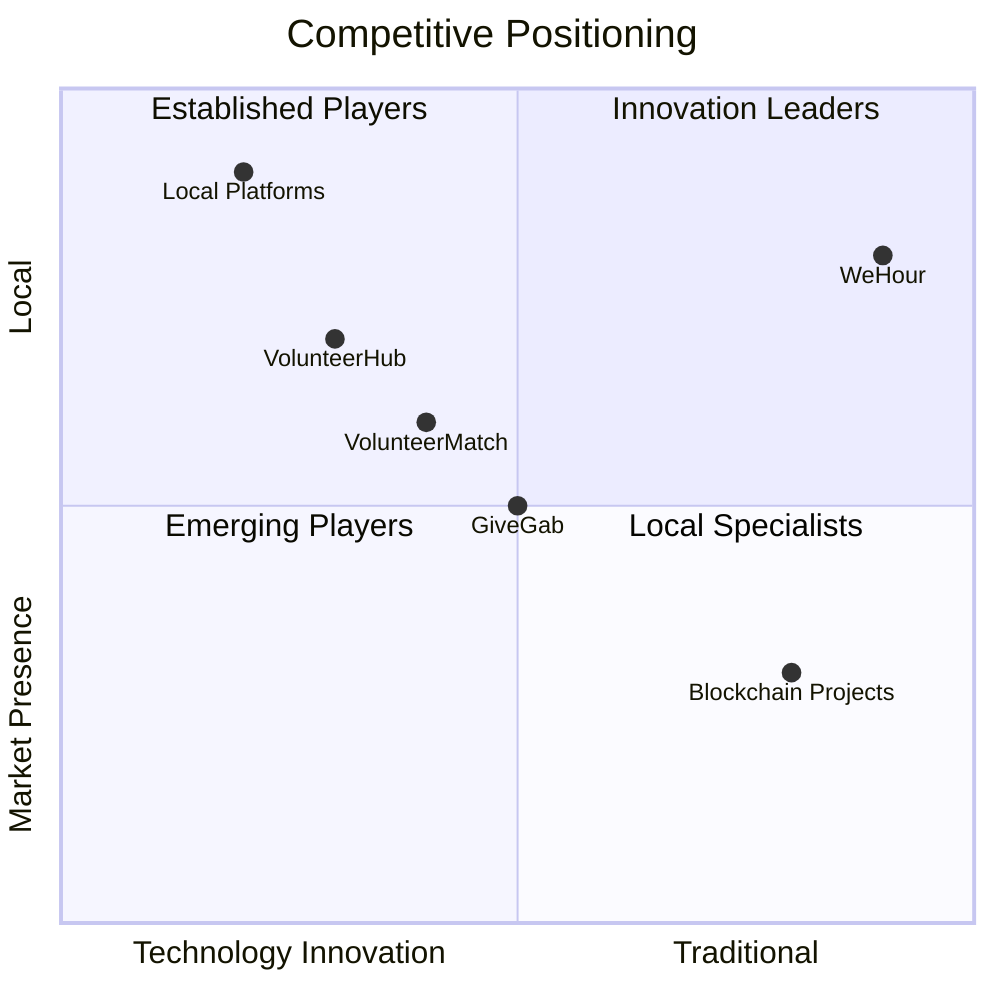

# Competitive Landscape
# 竞争格局

## 🏆 Market Positioning & Competitive Analysis

WeHour operates in a competitive landscape with both traditional volunteer management platforms and emerging blockchain-based solutions, positioning itself as the leading tokenized volunteer service platform.

---

## 🎯 Competitive Positioning

**Unique Value Proposition**: WeHour combines blockchain technology with user-friendly design, creating a unique position in the volunteer service market that traditional platforms cannot match.

### Market Position
- **Innovation Leader**: First-mover advantage in tokenized volunteer service
- **Technology Leader**: Advanced blockchain and cross-chain technology
- **User Experience Leader**: Best-in-class user experience
- **Local Market Leader**: Strong local market presence and expertise

---

## 🏢 Competitive Categories
## 竞争类别

### Competitive Landscape Map
### 竞争格局图

### Traditional Volunteer Management

<ul>
<li><strong>VolunteerHub:</strong> Traditional volunteer management platform</li>
<li><strong>VolunteerMatch:</strong> Volunteer matching and management</li>
<li><strong>SignUpGenius:</strong> Event management and volunteer coordination</li>
<li><strong>Local Platforms:</strong> Regional volunteer management systems</li>
</ul>

### Blockchain-Based Solutions

<ul>
<li><strong>Gitcoin:</strong> Open source development and funding</li>
<li><strong>Bounty0x:</strong> Decentralized bounty platform</li>
<li><strong>Colony:</strong> Decentralized organization platform</li>
<li><strong>Other Projects:</strong> Various blockchain volunteer projects</li>
</ul>

### Social Impact Platforms

<ul>
<li><strong>Impact Measurement:</strong> Social impact measurement platforms</li>
<li><strong>CSR Management:</strong> Corporate social responsibility tools</li>
<li><strong>Grant Management:</strong> Grant and funding management systems</li>
<li><strong>Community Platforms:</strong> Community engagement platforms</li>
</ul>

---

## 📊 Competitive Analysis Matrix

### Feature Comparison

<table>
<tr><th>Feature</th><th>WeHour</th><th>Traditional</th><th>Blockchain</th></tr>
<tr><td>Tokenization</td><td>✅ Dual-token model</td><td>❌ No tokens</td><td>⚠️ Limited tokens</td></tr>
<tr><td>Cross-Chain</td><td>✅ Multi-network</td><td>❌ Single platform</td><td>⚠️ Limited chains</td></tr>
<tr><td>User Experience</td><td>✅ Zero-crypto UX</td><td>✅ Good UX</td><td>❌ Complex UX</td></tr>
<tr><td>Verification</td><td>✅ Multi-attestation</td><td>⚠️ Manual</td><td>⚠️ Limited</td></tr>
<tr><td>Rewards</td><td>✅ Token rewards</td><td>❌ No rewards</td><td>⚠️ Limited rewards</td></tr>
<tr><td>Portability</td><td>✅ Cross-platform</td><td>❌ Platform-locked</td><td>⚠️ Limited</td></tr>
</table>

### Market Share Analysis

<ul>
<li><strong>Traditional Platforms:</strong> 80% of current market</li>
<li><strong>Blockchain Solutions:</strong> 15% of current market</li>
<li><strong>WeHour:</strong> 5% target market share (Year 1)</li>
<li><strong>Growth Potential:</strong> 20%+ market share (Year 5)</li>
</ul>

---

## 🏆 Competitive Advantages

### Technology Advantages

<ul>
<li><strong>Dual-Token Model:</strong> Unique VH$ and VB$ token system</li>
<li><strong>Cross-Chain Support:</strong> Multi-network blockchain support</li>
<li><strong>Zero-Crypto UX:</strong> User-friendly interface</li>
<li><strong>Advanced Verification:</strong> Multi-attestation verification system</li>
</ul>

### Market Advantages

<ul>
<li><strong>First-Mover Advantage:</strong> First tokenized volunteer service platform</li>
<li><strong>Local Expertise:</strong> Deep Hong Kong and regional market knowledge</li>
<li><strong>Partnership Network:</strong> Strong local partnership network</li>
<li><strong>Regulatory Compliance:</strong> Hong Kong regulatory compliance</li>
</ul>

### User Experience Advantages

<ul>
<li><strong>Ease of Use:</strong> Simple, intuitive user interface</li>
<li><strong>Mobile-First:</strong> Optimized for mobile devices</li>
<li><strong>Accessibility:</strong> Accessible to all user types</li>
<li><strong>Support:</strong> Comprehensive user support</li>
</ul>

---

## 🚫 Competitive Disadvantages

### Traditional Platform Disadvantages

<ul>
<li><strong>No Tokenization:</strong> Cannot tokenize volunteer service</li>
<li><strong>Limited Portability:</strong> Data locked to specific platforms</li>
<li><strong>No Rewards:</strong> Limited reward and recognition systems</li>
<li><strong>Manual Verification:</strong> Manual, error-prone verification</li>
</ul>

### Blockchain Platform Disadvantages

<ul>
<li><strong>Complex UX:</strong> Difficult for non-technical users</li>
<li><strong>Limited Adoption:</strong> Low mainstream adoption</li>
<li><strong>Regulatory Uncertainty:</strong> Unclear regulatory status</li>
<li><strong>High Costs:</strong> High transaction costs</li>
</ul>

---

## 🎯 Competitive Strategy

### Differentiation Strategy

<ul>
<li><strong>Technology Leadership:</strong> Advanced blockchain technology</li>
<li><strong>User Experience:</strong> Best-in-class user experience</li>
<li><strong>Local Focus:</strong> Strong local market presence</li>
<li><strong>Partnership Network:</strong> Strategic partnerships</li>
</ul>

### Market Entry Strategy

<ul>
<li><strong>Pilot Programs:</strong> Launch pilot programs with key partners</li>
<li><strong>Proof of Concept:</strong> Demonstrate value through results</li>
<li><strong>Gradual Expansion:</strong> Gradual market expansion</li>
<li><strong>Partnership Development:</strong> Strategic partnership development</li>
</ul>

---

## 🔍 Competitor Analysis

### Direct Competitors

<ul>
<li><strong>VolunteerHub:</strong> Traditional volunteer management</li>
<li><strong>VolunteerMatch:</strong> Volunteer matching platform</li>
<li><strong>Gitcoin:</strong> Blockchain-based development funding</li>
<li><strong>Bounty0x:</strong> Decentralized bounty platform</li>
</ul>

### Indirect Competitors

<ul>
<li><strong>Social Media:</strong> Social media volunteer coordination</li>
<li><strong>Event Platforms:</strong> Event management platforms</li>
<li><strong>CSR Tools:</strong> Corporate social responsibility tools</li>
<li><strong>Grant Platforms:</strong> Grant and funding platforms</li>
</ul>

---

## 📊 Competitive Metrics

### Performance Comparison

<ul>
<li><strong>User Adoption:</strong> User growth and retention rates</li>
<li><strong>Technology Performance:</strong> Platform speed and reliability</li>
<li><strong>User Satisfaction:</strong> User satisfaction and feedback</li>
<li><strong>Market Share:</strong> Market share and growth</li>
</ul>

### Competitive Intelligence

<ul>
<li><strong>Market Research:</strong> Regular market research and analysis</li>
<li><strong>Competitor Monitoring:</strong> Continuous competitor monitoring</li>
<li><strong>User Feedback:</strong> User feedback and insights</li>
<li><strong>Technology Trends:</strong> Technology trend analysis</li>
</ul>

---

## 🚀 Competitive Response Strategy

### Defensive Strategies

<ul>
<li><strong>Patent Protection:</strong> Intellectual property protection</li>
<li><strong>Partnership Lock-ins:</strong> Strategic partnership agreements</li>
<li><strong>Technology Barriers:</strong> Advanced technology barriers</li>
<li><strong>Market Dominance:</strong> Market share dominance</li>
</ul>

### Offensive Strategies

<ul>
<li><strong>Innovation Leadership:</strong> Continuous innovation and development</li>
<li><strong>Market Expansion:</strong> Aggressive market expansion</li>
<li><strong>Partnership Acquisition:</strong> Strategic partnership acquisition</li>
<li><strong>Technology Advancement:</strong> Advanced technology development</li>
</ul>

---

## 🔮 Future Competitive Landscape

### Emerging Competitors

<ul>
<li><strong>Big Tech Entry:</strong> Potential entry by major technology companies</li>
<li><strong>Blockchain Evolution:</strong> Evolution of blockchain volunteer platforms</li>
<li><strong>AI Integration:</strong> AI-powered volunteer management platforms</li>
<li><strong>Global Expansion:</strong> International platform expansion</li>
</ul>

### Competitive Threats

<ul>
<li><strong>Technology Disruption:</strong> New technology disruption</li>
<li><strong>Market Saturation:</strong> Market saturation and competition</li>
<li><strong>Regulatory Changes:</strong> Regulatory and policy changes</li>
<li><strong>Economic Factors:</strong> Economic and market conditions</li>
</ul>

---

## 💡 Competitive Use Cases

### WeHour Advantages

<ul>
<li><strong>Tokenization:</strong> Unique volunteer service tokenization</li>
<li><strong>Cross-Chain:</strong> Multi-network blockchain support</li>
<li><strong>User Experience:</strong> Zero-crypto user experience</li>
<li><strong>Local Expertise:</strong> Hong Kong and regional expertise</li>
</ul>

### Competitive Responses

<ul>
<li><strong>Innovation:</strong> Continuous innovation and development</li>
<li><strong>Partnerships:</strong> Strategic partnership development</li>
<li><strong>Market Expansion:</strong> Aggressive market expansion</li>
<li><strong>Technology Leadership:</strong> Technology leadership maintenance</li>
</ul>

---

## 📊 Competitive Metrics

### Key Performance Indicators

<ul>
<li><strong>Market Share:</strong> Market share and growth</li>
<li><strong>User Adoption:</strong> User growth and retention</li>
<li><strong>Technology Performance:</strong> Platform performance and reliability</li>
<li><strong>User Satisfaction:</strong> User satisfaction and feedback</li>
</ul>

### Competitive Benchmarking

<ul>
<li><strong>Feature Comparison:</strong> Feature-by-feature comparison</li>
<li><strong>Performance Comparison:</strong> Performance and reliability comparison</li>
<li><strong>User Experience:</strong> User experience comparison</li>
<li><strong>Market Position:</strong> Market position and share</li>
</ul>

---

*WeHour's competitive positioning leverages unique technology advantages, strong local market presence, and superior user experience to maintain competitive advantage in the volunteer service market. Through continuous innovation, strategic partnerships, and market expansion, the platform is well-positioned for long-term competitive success.*
