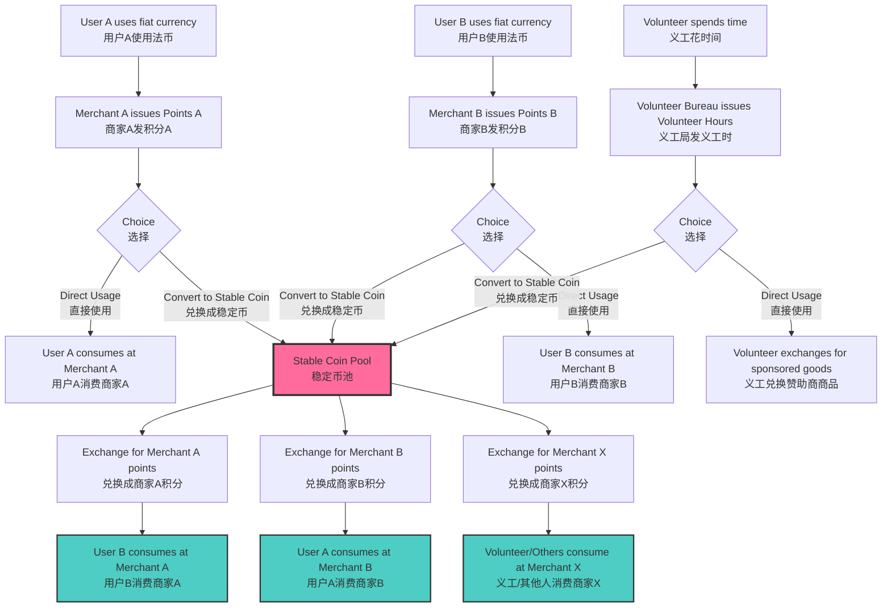
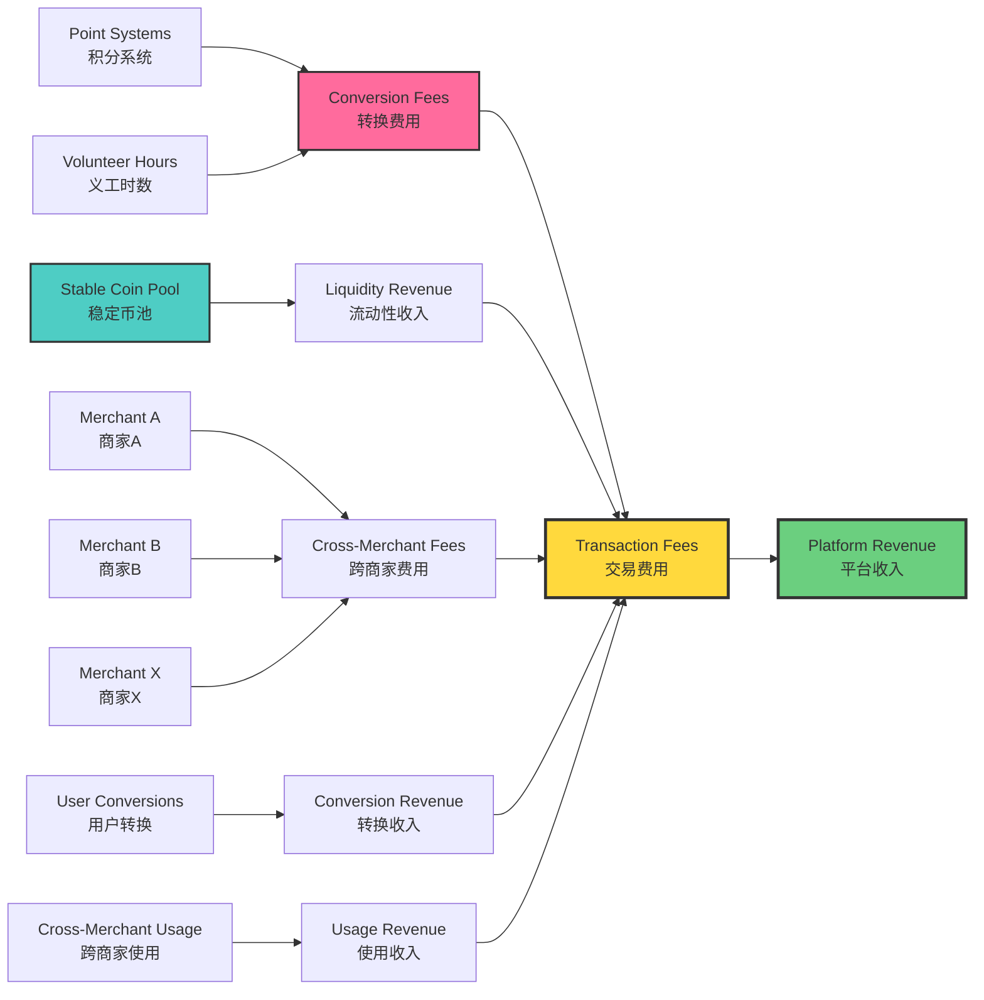
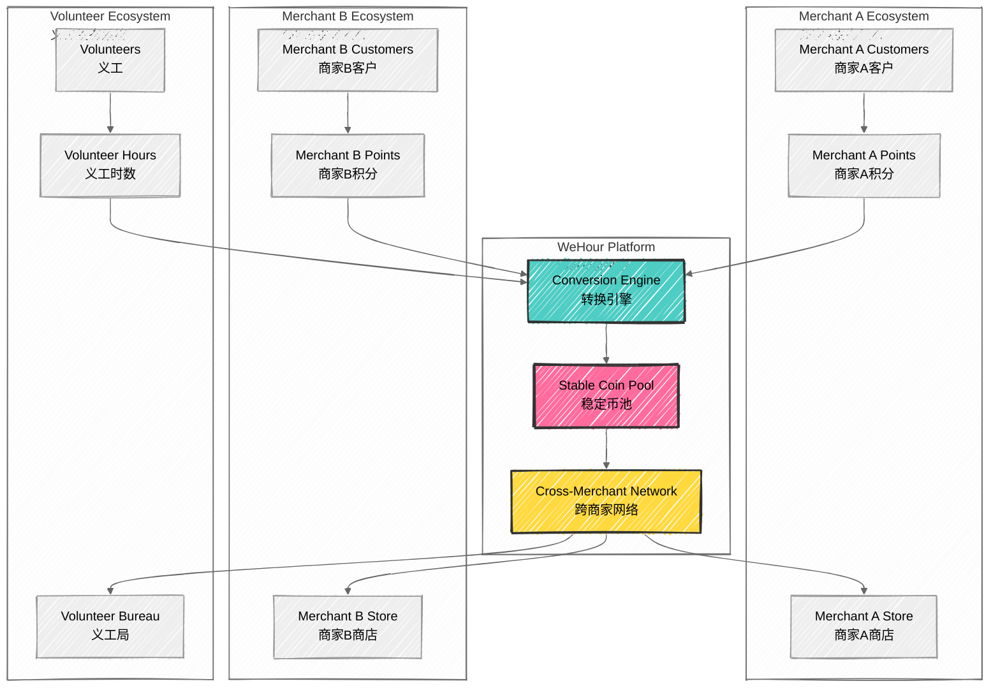

# Cross-Merchant Stable Coin Business Model
## 跨商家稳定币商业模式

## 🪙 Stable Coin Ecosystem Overview
## 稳定币生态系统概述

**Universal Exchange Medium**: WeHour's stable coin serves as a universal exchange medium that enables cross-merchant consumption, breaking down barriers between different point systems and volunteer hour programs.
**通用交换媒介**：WeHour的稳定币作为通用交换媒介，实现跨商家消费，打破不同积分系统和义工时数计划之间的壁垒。

---

## 🔄 Business Model Flow
## 商业模式流程

### Business Flow Diagram
### 业务流程图

### Point Acquisition Phase
### 积分获取阶段

<ul>
<li><strong>Merchant A Points:</strong> Users earn points from Merchant A through purchases</li>
<li><strong>Merchant B Points:</strong> Users earn points from Merchant B through purchases</li>
<li><strong>Volunteer Hours:</strong> Volunteers earn hours through community service</li>
<li><strong>Cross-Platform Points:</strong> Points from integrated partner platforms</li>
</ul>
<ul>
<li><strong>商家A积分</strong>：用户通过购买从商家A获得积分</li>
<li><strong>商家B积分</strong>：用户通过购买从商家B获得积分</li>
<li><strong>义工时数</strong>：志愿者通过社区服务获得时数</li>
<li><strong>跨平台积分</strong>：来自集成合作伙伴平台的积分</li>
</ul>

### Usage Choice Phase
### 使用选择阶段

<ul>
<li><strong>Direct Usage:</strong> Use points/hours directly within original ecosystem</li>
<li><strong>Stable Coin Conversion:</strong> Convert points/hours to stable coins for flexibility</li>
<li><strong>Hybrid Approach:</strong> Combine direct usage with stable coin conversion</li>
<li><strong>Strategic Planning:</strong> Plan usage based on merchant availability and preferences</li>
</ul>
<ul>
<li><strong>直接使用</strong>：在原始生态系统内直接使用积分/时数</li>
<li><strong>稳定币转换</strong>：将积分/时数转换为稳定币以获得灵活性</li>
<li><strong>混合方法</strong>：结合直接使用和稳定币转换</li>
<li><strong>战略规划</strong>：根据商家可用性和偏好规划使用</li>
</ul>

### Cross-Merchant Consumption Phase
### 跨商家消费阶段

<ul>
<li><strong>Universal Spending:</strong> Use stable coins across any participating merchant</li>
<li><strong>Value Preservation:</strong> Maintain value across different merchant ecosystems</li>
<li><strong>Enhanced Utility:</strong> Increased spending options and flexibility</li>
<li><strong>Network Effects:</strong> Benefits from growing merchant network</li>
</ul>
<ul>
<li><strong>通用消费</strong>：在任何参与的商家处使用稳定币</li>
<li><strong>价值保持</strong>：在不同商家生态系统中保持价值</li>
<li><strong>增强效用</strong>：增加消费选择和灵活性</li>
<li><strong>网络效应</strong>：从不断增长的商家网络中受益</li>
</ul>

---

## 💰 Revenue Generation
## 收入产生

### Revenue Flow Diagram
### 收入流程图

### Conversion Fees
### 转换费用

<ul>
<li><strong>Point to Stable Coin:</strong> 2-5% conversion fee</li>
<li><strong>Volunteer Hours to Stable Coin:</strong> 1-3% conversion fee</li>
<li><strong>Stable Coin to Points:</strong> 2-5% conversion fee</li>
<li><strong>Cross-Merchant Transactions:</strong> 1-2% transaction fee</li>
</ul>
<ul>
<li><strong>积分转稳定币</strong>：2-5%转换费用</li>
<li><strong>义工时数转稳定币</strong>：1-3%转换费用</li>
<li><strong>稳定币转积分</strong>：2-5%转换费用</li>
<li><strong>跨商家交易</strong>：1-2%交易费用</li>
</ul>

### Liquidity Pool Revenue
### 流动性池收入

<ul>
<li><strong>Liquidity Provision:</strong> Revenue from providing liquidity for conversions</li>
<li><strong>Interest Generation:</strong> Interest earned on stable coin reserves</li>
<li><strong>Arbitrage Opportunities:</strong> Revenue from price arbitrage between merchants</li>
<li><strong>Network Fees:</strong> Fees for maintaining cross-merchant network</li>
</ul>
<ul>
<li><strong>流动性提供</strong>：从提供转换流动性中获得收入</li>
<li><strong>利息产生</strong>：从稳定币储备中赚取利息</li>
<li><strong>套利机会</strong>：从商家间价格套利中获得收入</li>
<li><strong>网络费用</strong>：维护跨商家网络的费用</li>
</ul>

---

## 🏪 Merchant Integration
## 商家整合

### Merchant Ecosystem Diagram
### 商家生态系统图

### Merchant Onboarding
### 商家入驻

<ul>
<li><strong>Application Review:</strong> Comprehensive merchant application review</li>
<li><strong>Technical Integration:</strong> API integration and testing</li>
<li><strong>Compliance Check:</strong> Regulatory and compliance verification</li>
<li><strong>Launch Support:</strong> Marketing and launch support</li>
</ul>
<ul>
<li><strong>申请审核</strong>：全面的商家申请审核</li>
<li><strong>技术整合</strong>：API整合和测试</li>
<li><strong>合规检查</strong>：监管和合规验证</li>
<li><strong>启动支持</strong>：营销和启动支持</li>
</ul>

### Merchant Benefits
### 商家优势

<ul>
<li><strong>Customer Acquisition:</strong> Access to cross-merchant customer base</li>
<li><strong>Revenue Growth:</strong> Increased transaction volume and revenue</li>
<li><strong>Cost Reduction:</strong> Reduced customer acquisition costs</li>
<li><strong>Data Insights:</strong> Enhanced customer behavior analytics</li>
</ul>
<ul>
<li><strong>客户获取</strong>：获得跨商家客户群</li>
<li><strong>收入增长</strong>：增加交易量和收入</li>
<li><strong>成本降低</strong>：降低客户获取成本</li>
<li><strong>数据洞察</strong>：增强客户行为分析</li>
</ul>

---

## 👥 User Experience
## 用户体验

### Seamless Integration
### 无缝整合

<ul>
<li><strong>Point Earning:</strong> Earn points from various sources</li>
<li><strong>Conversion Decision:</strong> Choose to convert to stable coins</li>
<li><strong>Cross-Merchant Spending:</strong> Spend stable coins anywhere</li>
<li><strong>Value Maximization:</strong> Maximize value through strategic usage</li>
</ul>
<ul>
<li><strong>积分赚取</strong>：从各种来源赚取积分</li>
<li><strong>转换决策</strong>：选择转换为稳定币</li>
<li><strong>跨商家消费</strong>：在任何地方消费稳定币</li>
<li><strong>价值最大化</strong>：通过战略使用最大化价值</li>
</ul>

### Mobile App Features
### 移动应用功能

<ul>
<li><strong>Point Tracking:</strong> Track points from all sources</li>
<li><strong>Conversion Tools:</strong> Easy conversion to stable coins</li>
<li><strong>Merchant Discovery:</strong> Find participating merchants</li>
<li><strong>Transaction History:</strong> Complete transaction history</li>
</ul>
<ul>
<li><strong>积分追踪</strong>：追踪所有来源的积分</li>
<li><strong>转换工具</strong>：轻松转换为稳定币</li>
<li><strong>商家发现</strong>：找到参与的商家</li>
<li><strong>交易历史</strong>：完整的交易历史</li>
</ul>

---

## 📊 Business Metrics
## 业务指标

### Key Performance Indicators
### 关键绩效指标

<ul>
<li><strong>Conversion Rate:</strong> Percentage of points/hours converted to stable coins</li>
<li><strong>Cross-Merchant Usage:</strong> Usage of stable coins across merchants</li>
<li><strong>Merchant Network Growth:</strong> Number of participating merchants</li>
<li><strong>Transaction Volume:</strong> Total stable coin transaction volume</li>
</ul>
<ul>
<li><strong>转换率</strong>：转换为稳定币的积分/时数百分比</li>
<li><strong>跨商家使用</strong>：稳定币在商家间的使用情况</li>
<li><strong>商家网络增长</strong>：参与商家数量</li>
<li><strong>交易量</strong>：稳定币总交易量</li>
</ul>

### Revenue Projections
### 收入预测

<ul>
<li><strong>Year 1:</strong> HKD 5-10M from conversion fees</li>
<li><strong>Year 2:</strong> HKD 15-25M from network effects</li>
<li><strong>Year 3:</strong> HKD 30-50M from full ecosystem</li>
<li><strong>Year 5:</strong> HKD 100M+ from global expansion</li>
</ul>
<ul>
<li><strong>第1年</strong>：从转换费用中获得500-1000万港币</li>
<li><strong>第2年</strong>：从网络效应中获得1500-2500万港币</li>
<li><strong>第3年</strong>：从完整生态系统中获得3000-5000万港币</li>
<li><strong>第5年</strong>：从全球扩张中获得1亿+港币</li>
</ul>

---

## 🔮 Future Development
## 未来发展

### Technology Evolution
### 技术演进

<ul>
<li><strong>AI-Powered Optimization:</strong> AI-driven conversion recommendations</li>
<li><strong>Predictive Analytics:</strong> Predictive spending behavior analysis</li>
<li><strong>Blockchain Integration:</strong> Enhanced blockchain security and transparency</li>
<li><strong>Global Expansion:</strong> International merchant network expansion</li>
</ul>
<ul>
<li><strong>AI驱动优化</strong>：AI驱动的转换推荐</li>
<li><strong>预测分析</strong>：预测消费行为分析</li>
<li><strong>区块链整合</strong>：增强区块链安全性和透明度</li>
<li><strong>全球扩张</strong>：国际商家网络扩张</li>
</ul>

### Market Expansion
### 市场扩张

<ul>
<li><strong>Regional Growth:</strong> Expand to Macau, Singapore, Taiwan</li>
<li><strong>Industry Diversification:</strong> Enter new industry verticals</li>
<li><strong>Partnership Development:</strong> Strategic partnerships with major retailers</li>
<li><strong>Technology Integration:</strong> Integration with existing payment systems</li>
</ul>
<ul>
<li><strong>区域增长</strong>：扩展到澳门、新加坡、台湾</li>
<li><strong>行业多元化</strong>：进入新的行业垂直领域</li>
<li><strong>合作伙伴发展</strong>：与主要零售商的战略合作</li>
<li><strong>技术整合</strong>：与现有支付系统整合</li>
</ul>

---

*WeHour's cross-merchant stable coin business model creates a universal exchange ecosystem that breaks down barriers between different point systems, enabling seamless cross-merchant consumption while generating sustainable revenue through conversion fees and network effects.*
*WeHour的跨商家稳定币商业模式创建了一个通用交换生态系统，打破不同积分系统之间的壁垒，实现无缝跨商家消费，同时通过转换费用和网络效应产生可持续收入。*
