# Go-to-Market Strategy

## 🚀 Comprehensive Market Entry Strategy

WeHour's go-to-market strategy focuses on establishing strong local market presence, building strategic partnerships, and demonstrating clear value to stakeholders through pilot programs and gradual market expansion.

---

## 🎯 GTM Strategy Overview
## GTM策略概述

### GTM Strategy Flow
### GTM策略流程

**Phased Approach**: WeHour employs a phased go-to-market strategy, starting with Hong Kong market establishment, followed by regional expansion and global growth.
**分阶段方法**：WeHour采用分阶段的进入市场策略，从香港市场建立开始，然后是区域扩张和全球增长。

### Strategic Principles
- **Local First**: Establish strong local market presence
- **Partnership Driven**: Build strategic partnerships for market access
- **Value Demonstration**: Prove value through pilot programs
- **Gradual Expansion**: Systematic market expansion

---

## 🏗️ Phase 1: Foundation (0-12 months)

### Market Entry Strategy
<ul>
<li><strong>Pilot Programs:</strong> 2-3 anchor events with 500-1,000 volunteers</li>
<li><strong>Partner Onboarding:</strong> 10+ organizations, 1-2 retailers</li>
<li><strong>Proof of Concept:</strong> Demonstrate platform value and functionality</li>
<li><strong>Market Validation:</strong> Validate market demand and user adoption</li>
</ul>

### Key Activities
<ul>
<li><strong>Platform Launch:</strong> Full platform deployment and testing</li>
<li><strong>Partnership Development:</strong> Strategic partnership establishment</li>
<li><strong>User Acquisition:</strong> Initial user acquisition and onboarding</li>
<li><strong>Market Education:</strong> Market education and awareness building</li>
</ul>

### Success Metrics
<ul>
<li><strong>Organizations:</strong> 10+ active organizations</li>
<li><strong>Volunteers:</strong> 1,000+ active volunteers</li>
<li><strong>Verified Hours:</strong> 10,000+ verified volunteer hours</li>
<li><strong>Revenue:</strong> HKD 2-5M revenue</li>
</ul>

---

## 📈 Phase 2: Growth (12-24 months)

### Market Expansion
<ul>
<li><strong>Macau Launch:</strong> Macau market entry and expansion</li>
<li><strong>Regional Partnerships:</strong> Regional partnership development</li>
<li><strong>Feature Enhancement:</strong> Advanced platform features and capabilities</li>
<li><strong>User Growth:</strong> Significant user growth and adoption</li>
</ul>

### Key Activities
<ul>
<li><strong>Market Expansion:</strong> Regional market expansion</li>
<li><strong>Partnership Growth:</strong> Strategic partnership expansion</li>
<li><strong>Feature Development:</strong> Advanced feature development</li>
<li><strong>User Engagement:</strong> Enhanced user engagement and retention</li>
</ul>

### Success Metrics
<ul>
<li><strong>Organizations:</strong> 50+ active organizations</li>
<li><strong>Volunteers:</strong> 5,000+ active volunteers</li>
<li><strong>Verified Hours:</strong> 50,000+ verified volunteer hours</li>
<li><strong>Revenue:</strong> HKD 10-20M revenue</li>
</ul>

---

## 🌍 Phase 3: Maturity (24+ months)

### Global Expansion
<ul>
<li><strong>International Markets:</strong> Singapore, Taiwan, South Korea</li>
<li><strong>Global Partnerships:</strong> International partnership development</li>
<li><strong>Advanced Features:</strong> AI-powered insights and automation</li>
<li><strong>Ecosystem Integration:</strong> Cross-platform and cross-chain integration</li>
</ul>

### Key Activities
<ul>
<li><strong>Global Expansion:</strong> International market expansion</li>
<li><strong>Technology Innovation:</strong> Advanced technology development</li>
<li><strong>Ecosystem Development:</strong> Comprehensive ecosystem development</li>
<li><strong>Market Leadership:</strong> Market leadership establishment</li>
</ul>

### Success Metrics
<ul>
<li><strong>Organizations:</strong> 100+ active organizations</li>
<li><strong>Volunteers:</strong> 10,000+ active volunteers</li>
<li><strong>Verified Hours:</strong> 100,000+ verified volunteer hours</li>
<li><strong>Revenue:</strong> HKD 25-50M revenue</li>
</ul>

---

## 🤝 Partnership Strategy

### Strategic Partnerships
<ul>
<li><strong>NGO Partnerships:</strong> Strategic partnerships with key NGOs</li>
<li><strong>Corporate Partnerships:</strong> Corporate CSR program partnerships</li>
<li><strong>Government Partnerships:</strong> Government agency partnerships</li>
<li><strong>Technology Partnerships:</strong> Technology and integration partnerships</li>
</ul>

### Partnership Development
<ul>
<li><strong>Identification:</strong> Identify potential partnership opportunities</li>
<li><strong>Outreach:</strong> Strategic outreach and relationship building</li>
<li><strong>Negotiation:</strong> Partnership agreement negotiation</li>
<li><strong>Implementation:</strong> Partnership implementation and management</li>
</ul>

---

## 📢 Marketing Strategy

### Marketing Channels
<ul>
<li><strong>Digital Marketing:</strong> Online advertising and social media</li>
<li><strong>Content Marketing:</strong> Educational content and thought leadership</li>
<li><strong>Event Marketing:</strong> Industry events and conferences</li>
<li><strong>Partnership Marketing:</strong> Co-marketing with partners</li>
</ul>

### Marketing Activities
<ul>
<li><strong>Brand Building:</strong> Brand awareness and recognition building</li>
<li><strong>Lead Generation:</strong> Lead generation and qualification</li>
<li><strong>User Acquisition:</strong> User acquisition and onboarding</li>
<li><strong>Retention Marketing:</strong> User retention and engagement</li>
</ul>

---

## 🎯 Target Customer Acquisition
## 目标客户获取

### Customer Acquisition Funnel
### 客户获取漏斗

```mermaid
graph TD
    A[Awareness<br/>认知] --> B[Interest<br/>兴趣]
    B --> C[Consideration<br/>考虑]
    C --> D[Evaluation<br/>评估]
    D --> E[Decision<br/>决策]
    E --> F[Onboarding<br/>入驻]
    F --> G[Activation<br/>激活]
    G --> H[Retention<br/>留存]
    H --> I[Advocacy<br/>推荐]
    
    J[Marketing Campaigns<br/>营销活动] --> A
    K[Content Marketing<br/>内容营销] --> B
    L[Webinars & Events<br/>网络研讨会和活动] --> C
    M[Pilot Programs<br/>试点项目] --> D
    N[Sales Process<br/>销售流程] --> E
    O[Implementation Support<br/>实施支持] --> F
    P[Training & Support<br/>培训和支持] --> G
    Q[Success Management<br/>成功管理] --> H
    R[Referral Programs<br/>推荐计划] --> I
    
    style A fill:#ff6b9d,stroke:#333,stroke-width:2px
    style E fill:#4ecdc4,stroke:#333,stroke-width:2px
    style F fill:#ffd93d,stroke:#333,stroke-width:2px
    style I fill:#6bcf7f,stroke:#333,stroke-width:2px
```

### Customer Segments
<ul>
<li><strong>NGOs:</strong> Non-profit organizations and charities</li>
<li><strong>Educational Institutions:</strong> Schools and universities</li>
<li><strong>Corporate CSR:</strong> Corporate social responsibility programs</li>
<li><strong>Government Agencies:</strong> Public sector volunteer programs</li>
</ul>

### Acquisition Strategy
<ul>
<li><strong>Pilot Programs:</strong> Launch pilot programs with key customers</li>
<li><strong>Proof of Concept:</strong> Demonstrate value through results</li>
<li><strong>Referral Programs:</strong> Customer referral and recommendation programs</li>
<li><strong>Partnership Channels:</strong> Partnership-driven customer acquisition</li>
</ul>

---

## 💰 Pricing Strategy

### Pricing Model
<ul>
<li><strong>Value-Based Pricing:</strong> Price based on value delivered</li>
<li><strong>Tiered Pricing:</strong> Multiple pricing tiers for different needs</li>
<li><strong>Freemium Model:</strong> Free tier with premium features</li>
<li><strong>Volume Discounts:</strong> Volume-based pricing discounts</li>
</ul>

### Pricing Tiers
<ul>
<li><strong>Basic Plan:</strong> HKD 500/org/month (up to 100 volunteers)</li>
<li><strong>Professional Plan:</strong> HKD 1,000/org/month (up to 500 volunteers)</li>
<li><strong>Enterprise Plan:</strong> HKD 2,000/org/month (unlimited volunteers)</li>
<li><strong>Custom Plans:</strong> Tailored pricing for large organizations</li>
</ul>

---

## 📊 Sales Strategy

### Sales Process
<ul>
<li><strong>Lead Generation:</strong> Lead generation and qualification</li>
<li><strong>Discovery:</strong> Customer needs and requirements discovery</li>
<li><strong>Proposal:</strong> Solution proposal and presentation</li>
<li><strong>Negotiation:</strong> Contract negotiation and closing</li>
</ul>

### Sales Channels
<ul>
<li><strong>Direct Sales:</strong> Direct sales team and approach</li>
<li><strong>Partner Sales:</strong> Partner-driven sales and referrals</li>
<li><strong>Online Sales:</strong> Online sales and self-service</li>
<li><strong>Channel Sales:</strong> Channel partner sales</li>
</ul>

---

## 🎯 Success Metrics

### Key Performance Indicators
<ul>
<li><strong>Customer Acquisition:</strong> New customer acquisition rate</li>
<li><strong>Revenue Growth:</strong> Month-over-month revenue growth</li>
<li><strong>Market Share:</strong> Market share and growth</li>
<li><strong>User Engagement:</strong> User engagement and retention</li>
</ul>

### Success Metrics
<ul>
<li><strong>Organizations:</strong> Number of active organizations</li>
<li><strong>Volunteers:</strong> Number of active volunteers</li>
<li><strong>Verified Hours:</strong> Total verified volunteer hours</li>
<li><strong>Revenue:</strong> Total revenue and growth</li>
</ul>

---

## 🔮 Future GTM Evolution

### Advanced Strategies
<ul>
<li><strong>AI-Powered Marketing:</strong> AI-driven marketing and personalization</li>
<li><strong>Global Expansion:</strong> International market expansion</li>
<li><strong>Ecosystem Development:</strong> Comprehensive ecosystem development</li>
<li><strong>Technology Innovation:</strong> Advanced technology integration</li>
</ul>

### Innovation Areas
<ul>
<li><strong>Marketing Automation:</strong> Automated marketing and sales processes</li>
<li><strong>Personalization:</strong> Personalized customer experiences</li>
<li><strong>Predictive Analytics:</strong> Predictive customer and market analytics</li>
<li><strong>Cross-Platform Integration:</strong> Multi-platform integration and synergy</li>
</ul>

---

## 💡 GTM Use Cases

### NGO Acquisition
<ul>
<li><strong>Pilot Programs:</strong> Launch pilot programs with key NGOs</li>
<li><strong>Value Demonstration:</strong> Demonstrate value through results</li>
<li><strong>Partnership Development:</strong> Build strategic partnerships</li>
<li><strong>Referral Programs:</strong> Customer referral and recommendation</li>
</ul>

### Corporate Acquisition
<ul>
<li><strong>CSR Programs:</strong> Corporate social responsibility programs</li>
<li><strong>Brand Campaigns:</strong> Brand association with social causes</li>
<li><strong>Employee Programs:</strong> Employee volunteer programs</li>
<li><strong>Impact Measurement:</strong> Social impact measurement and reporting</li>
</ul>

### Educational Acquisition
<ul>
<li><strong>Student Programs:</strong> Student volunteer programs</li>
<li><strong>Academic Recognition:</strong> Academic credit for volunteer service</li>
<li><strong>Career Development:</strong> Professional credential development</li>
<li><strong>Community Impact:</strong> Community service impact measurement</li>
</ul>

---

## 📊 GTM Analytics

### Performance Tracking
<ul>
<li><strong>Customer Acquisition Cost (CAC):</strong> Cost to acquire customers</li>
<li><strong>Customer Lifetime Value (CLV):</strong> Long-term customer value</li>
<li><strong>Conversion Rates:</strong> Lead to customer conversion rates</li>
<li><strong>Retention Rates:</strong> Customer retention and churn rates</li>
</ul>

### Market Intelligence
<ul>
<li><strong>Market Trends:</strong> Market trend analysis and insights</li>
<li><strong>Competitive Analysis:</strong> Competitive landscape analysis</li>
<li><strong>Customer Feedback:</strong> Customer feedback and insights</li>
<li><strong>Performance Optimization:</strong> Performance optimization and improvement</li>
</ul>

---

*WeHour's go-to-market strategy provides a comprehensive approach to market entry, customer acquisition, and growth. Through phased expansion, strategic partnerships, and value-driven marketing, the platform is well-positioned for market success and long-term growth.*
