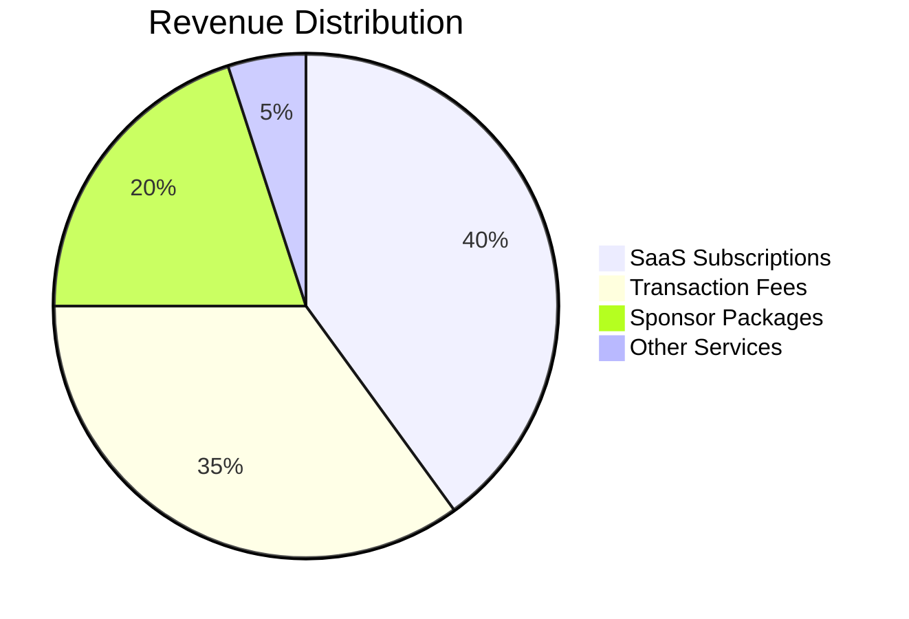
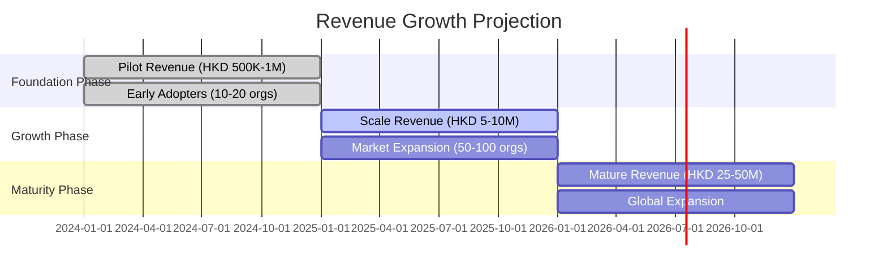

# Revenue Streams 收入来源

## 💰 Sustainable Business Model 可持续商业模式

WeHour's revenue model is designed for long-term sustainability, focusing on value creation for all stakeholders while generating sustainable revenue through multiple streams.
WeHour的收入模式旨在实现长期可持续发展，专注于为所有利益相关者创造价值，同时通过多种收入来源产生可持续收入。

---

## 🎯 Revenue Strategy 收入策略

**Value-Driven Revenue**: Revenue is generated through value creation for volunteers, organizations, and sponsors, ensuring sustainable growth and stakeholder satisfaction.
**价值驱动收入**：通过为志愿者、组织和赞助商创造价值来产生收入，确保可持续增长和利益相关者满意度。

### Revenue Principles 收入原则

- **Value Creation**: Revenue tied to actual value delivered
- **Stakeholder Alignment**: Revenue benefits all platform participants
- **Sustainable Growth**: Long-term revenue sustainability
- **Transparent Pricing**: Clear, fair pricing for all services

- **价值创造**：收入与实际交付的价值挂钩
- **利益相关者一致性**：收入使所有平台参与者受益
- **可持续增长**：长期收入可持续性
- **透明定价**：为所有服务提供清晰、公平的定价

---

## 💼 Primary Revenue Streams
## 主要收入来源

### Revenue Streams Overview
### 收入来源概述

### Cross-Merchant Stable Coin Ecosystem
### 跨商家稳定币生态系统

<h4>🪙 Stable Coin Revenue Model</h4>
<h4>稳定币收入模式</h4>
<ul>
<li><strong>Point Acquisition:</strong> Users obtain points from merchants or volunteer hours from organizations</li>
<li><strong>Stable Coin Conversion:</strong> Points and volunteer hours can be converted to stable coins for cross-merchant use</li>
<li><strong>Cross-Merchant Consumption:</strong> Stable coins enable spending across different merchant networks</li>
<li><strong>Transaction Fees:</strong> Revenue from conversion and cross-merchant transaction fees</li>
</ul>
<ul>
<li><strong>积分获取</strong>：用户从商家获得积分或从组织获得义工时数</li>
<li><strong>稳定币转换</strong>：积分和义工时数可转换为稳定币用于跨商家消费</li>
<li><strong>跨商家消费</strong>：稳定币支持在不同商家网络中消费</li>
<li><strong>交易费用</strong>：从转换和跨商家交易费用中获得收入</li>
</ul>

### Revenue from Point Systems
### 积分系统收入

<h4>💳 Point System Revenue</h4>
<h4>积分系统收入</h4>
<ul>
<li><strong>Merchant A Points:</strong> Revenue from Merchant A point transactions and conversions</li>
<li><strong>Merchant B Points:</strong> Revenue from Merchant B point transactions and conversions</li>
<li><strong>Volunteer Hours:</strong> Revenue from volunteer hour tracking and conversion to stable coins</li>
<li><strong>Cross-Merchant Fees:</strong> Fees for converting between different point systems</li>
</ul>
<ul>
<li><strong>商家A积分</strong>：从商家A积分交易和转换中获得收入</li>
<li><strong>商家B积分</strong>：从商家B积分交易和转换中获得收入</li>
<li><strong>义工时数</strong>：从义工时数追踪和转换为稳定币中获得收入</li>
<li><strong>跨商家费用</strong>：在不同积分系统间转换的费用</li>
</ul>

### Stable Coin Pool Revenue
### 稳定币池收入

<h4>🏦 Stable Coin Pool</h4>
<h4>稳定币池</h4>
<ul>
<li><strong>Conversion Fees:</strong> Fees for converting points/hours to stable coins</li>
<li><strong>Cross-Merchant Fees:</strong> Fees for using stable coins across different merchants</li>
<li><strong>Liquidity Provision:</strong> Revenue from providing liquidity for cross-merchant transactions</li>
<li><strong>Exchange Services:</strong> Revenue from stable coin exchange and conversion services</li>
</ul>
<ul>
<li><strong>转换费用</strong>：将积分/时数转换为稳定币的费用</li>
<li><strong>跨商家费用</strong>：在不同商家间使用稳定币的费用</li>
<li><strong>流动性提供</strong>：为跨商家交易提供流动性获得的收入</li>
<li><strong>兑换服务</strong>：从稳定币兑换和转换服务中获得的收入</li>
</ul>

### SaaS Subscriptions
### SaaS订阅服务

<h4>💻 Platform Subscriptions</h4>
<h4>平台订阅</h4>
<ul>
<li><strong>Organization Plans:</strong> HKD 500-2,000/org/month</li>
<li><strong>Volunteer Plans:</strong> HKD 2-5 per active volunteer (tiered)</li>
<li><strong>Feature Tiers:</strong> Basic, Professional, Enterprise</li>
<li><strong>Custom Solutions:</strong> Tailored solutions for large organizations</li>
</ul>
<ul>
<li><strong>组织计划</strong>：每月500-2,000港币/组织</li>
<li><strong>志愿者计划</strong>：每个活跃志愿者2-5港币（分层）</li>
<li><strong>功能层级</strong>：基础版、专业版、企业版</li>
<li><strong>定制解决方案</strong>：为大型组织量身定制的解决方案</li>
</ul>

### Transaction Fees
### 交易费用

<h4>💳 Transaction Revenue</h4>
<h4>交易收入</h4>
<ul>
<li><strong>VH$ Transactions:</strong> 5-10% on VH$ transaction volume</li>
<li><strong>Reward Redemptions:</strong> Fee on reward redemptions</li>
<li><strong>Cross-Chain Transfers:</strong> Fee on cross-chain token transfers</li>
<li><strong>Marketplace Fees:</strong> Fee on marketplace transactions</li>
</ul>
<ul>
<li><strong>VH$交易</strong>：VH$交易量的5-10%</li>
<li><strong>奖励兑换</strong>：奖励兑换费用</li>
<li><strong>跨链转账</strong>：跨链代币转账费用</li>
<li><strong>市场费用</strong>：市场交易费用</li>
</ul>

### Sponsor Packages

<h4>💰 Corporate Sponsorships</h4>
<ul>
<li><strong>Campaign Packages:</strong> HKD 50-500k branded campaigns</li>
<li><strong>Impact Reporting:</strong> Detailed impact and ROI reports</li>
<li><strong>Matching Programs:</strong> Corporate matching donation programs</li>
<li><strong>Brand Integration:</strong> Brand integration in volunteer experiences</li>
</ul>

---

## 📊 Revenue Breakdown
## 收入分解

### Revenue Growth Timeline
### 收入增长时间线

### Revenue Distribution

<h4>📈 Revenue Sources</h4>
<ul>
<li><strong>SaaS Subscriptions:</strong> 40% of total revenue</li>
<li><strong>Transaction Fees:</strong> 35% of total revenue</li>
<li><strong>Sponsor Packages:</strong> 20% of total revenue</li>
<li><strong>Other Services:</strong> 5% of total revenue</li>
</ul>

### Growth Projections

<h4>📊 Revenue Growth</h4>
<ul>
<li><strong>Year 1:</strong> HKD 2-5M revenue</li>
<li><strong>Year 2:</strong> HKD 10-20M revenue</li>
<li><strong>Year 3:</strong> HKD 25-50M revenue</li>
<li><strong>Year 5:</strong> HKD 100M+ revenue</li>
</ul>

---

## 🎯 Target Market Segments

### Primary Markets

<h4>🎯 Target Segments</h4>
<ul>
<li><strong>NGOs:</strong> Non-profit organizations and charities</li>
<li><strong>Educational Institutions:</strong> Schools and universities</li>
<li><strong>Corporate CSR:</strong> Corporate social responsibility programs</li>
<li><strong>Government Agencies:</strong> Public sector volunteer programs</li>
</ul>

### Market Sizing

<h4>📊 Market Opportunity</h4>
<ul>
<li><strong>TAM:</strong> $2.3B Asia-Pacific volunteer service market</li>
<li><strong>SAM:</strong> $180M Hong Kong volunteer ecosystem</li>
<li><strong>SOM:</strong> $15M addressable market for tokenized services</li>
<li><strong>Growth Rate:</strong> 15-20% annual market growth</li>
</ul>

---

## 💡 Value Proposition by Segment

### For NGOs

<h4>🏢 NGO Benefits</h4>
<ul>
<li><strong>Cost Reduction:</strong> 80% reduction in volunteer management costs</li>
<li><strong>Enhanced Funding:</strong> Verifiable impact data for funders</li>
<li><strong>Volunteer Retention:</strong> Recognition and reward systems</li>
<li><strong>Impact Measurement:</strong> Transparent reporting capabilities</li>
</ul>

### For Educational Institutions

<h4>🎓 Educational Benefits</h4>
<ul>
<li><strong>Student Engagement:</strong> Enhanced student volunteer participation</li>
<li><strong>Academic Recognition:</strong> Volunteer service for academic credit</li>
<li><strong>Career Development:</strong> Professional credential development</li>
<li><strong>Community Impact:</strong> Measurable community service impact</li>
</ul>

### For Corporate Sponsors

<h4>💰 Corporate Benefits</h4>
<ul>
<li><strong>CSR Impact:</strong> Verifiable corporate social responsibility impact</li>
<li><strong>Brand Association:</strong> Positive brand association with social causes</li>
<li><strong>Employee Engagement:</strong> Employee volunteer program participation</li>
<li><strong>ROI Measurement:</strong> Clear return on social investment</li>
</ul>

---

## 🔄 Revenue Model Evolution

### Phase 1: Foundation (0-12 months)

<h4>🏗️ Foundation Phase</h4>
<ul>
<li><strong>Pilot Revenue:</strong> HKD 500K-1M from pilot programs</li>
<li><strong>Early Adopters:</strong> 10-20 organizations</li>
<li><strong>Basic Features:</strong> Core platform functionality</li>
<li><strong>Market Validation:</strong> Prove value proposition</li>
</ul>

### Phase 2: Growth (12-24 months)

<h4>📈 Growth Phase</h4>
<ul>
<li><strong>Scale Revenue:</strong> HKD 5-10M from expanded operations</li>
<li><strong>Market Expansion:</strong> 50-100 organizations</li>
<li><strong>Enhanced Features:</strong> Advanced analytics and reporting</li>
<li><strong>Partnership Growth:</strong> Strategic partnerships and integrations</li>
</ul>

### Phase 3: Maturity (24+ months)

<h4>🌍 Maturity Phase</h4>
<ul>
<li><strong>Mature Revenue:</strong> HKD 25-50M from full market penetration</li>
<li><strong>Global Expansion:</strong> International markets and recognition</li>
<li><strong>Advanced Features:</strong> AI-powered insights and automation</li>
<li><strong>Ecosystem Integration:</strong> Cross-platform and cross-chain integration</li>
</ul>

---

## 💰 Pricing Strategy

### Subscription Pricing

<h4>💻 SaaS Pricing</h4>
<ul>
<li><strong>Basic Plan:</strong> HKD 500/org/month (up to 100 volunteers)</li>
<li><strong>Professional Plan:</strong> HKD 1,000/org/month (up to 500 volunteers)</li>
<li><strong>Enterprise Plan:</strong> HKD 2,000/org/month (unlimited volunteers)</li>
<li><strong>Custom Plans:</strong> Tailored pricing for large organizations</li>
</ul>

### Transaction Pricing

<h4>💳 Transaction Fees</h4>
<ul>
<li><strong>VH$ Transactions:</strong> 5-10% of transaction value</li>
<li><strong>Reward Redemptions:</strong> 2-5% of redemption value</li>
<li><strong>Cross-Chain Transfers:</strong> 1-3% of transfer value</li>
<li><strong>Marketplace Fees:</strong> 3-7% of marketplace transactions</li>
</ul>

### Sponsor Pricing

<h4>💰 Sponsor Packages</h4>
<ul>
<li><strong>Basic Campaign:</strong> HKD 50-100k (local impact)</li>
<li><strong>Professional Campaign:</strong> HKD 200-300k (regional impact)</li>
<li><strong>Enterprise Campaign:</strong> HKD 400-500k (global impact)</li>
<li><strong>Custom Campaigns:</strong> Tailored pricing for specific needs</li>
</ul>

---

## 📊 Revenue Analytics

### Key Metrics

<h4>📈 Revenue KPIs</h4>
<ul>
<li><strong>Monthly Recurring Revenue (MRR):</strong> Subscription revenue</li>
<li><strong>Transaction Volume:</strong> Total transaction value</li>
<li><strong>Customer Acquisition Cost (CAC):</strong> Cost to acquire customers</li>
<li><strong>Customer Lifetime Value (CLV):</strong> Long-term customer value</li>
</ul>

### Performance Indicators

<h4>📊 Performance Metrics</h4>
<ul>
<li><strong>Revenue Growth:</strong> Month-over-month revenue growth</li>
<li><strong>Churn Rate:</strong> Customer retention rate</li>
<li><strong>Average Revenue Per User (ARPU):</strong> Revenue per user</li>
<li><strong>Gross Margin:</strong> Revenue minus direct costs</li>
</ul>

---

## 🚀 Revenue Optimization

### Growth Strategies

<h4>📈 Growth Tactics</h4>
<ul>
<li><strong>Upselling:</strong> Upgrade existing customers to higher tiers</li>
<li><strong>Cross-selling:</strong> Sell additional services to existing customers</li>
<li><strong>Market Expansion:</strong> Enter new markets and segments</li>
<li><strong>Partnership Revenue:</strong> Revenue from strategic partnerships</li>
</ul>

### Cost Optimization

<h4>💰 Cost Management</h4>
<ul>
<li><strong>Operational Efficiency:</strong> Streamline operations and reduce costs</li>
<li><strong>Technology Optimization:</strong> Optimize technology infrastructure</li>
<li><strong>Automation:</strong> Automate processes to reduce manual costs</li>
<li><strong>Scale Economics:</strong> Leverage scale to reduce per-unit costs</li>
</ul>

---

## 🔮 Future Revenue Opportunities

### Emerging Revenue Streams

<h4>🚀 New Opportunities</h4>
<ul>
<li><strong>Data Analytics:</strong> Advanced analytics and insights services</li>
<li><strong>Consulting Services:</strong> Volunteer program consulting</li>
<li><strong>Training Programs:</strong> Volunteer management training</li>
<li><strong>White-Label Solutions:</strong> Custom platform solutions</li>
</ul>

### Innovation Areas

<h4>💡 Innovation Focus</h4>
<ul>
<li><strong>AI-Powered Services:</strong> AI-driven volunteer matching and optimization</li>
<li><strong>Blockchain Services:</strong> Blockchain consulting and implementation</li>
<li><strong>Cross-Platform Integration:</strong> Integration with other platforms</li>
<li><strong>Global Expansion:</strong> International market expansion</li>
</ul>

---

## 💡 Revenue Use Cases

### NGO Revenue

<h4>🏢 NGO Scenarios</h4>
<ul>
<li><strong>Small NGO:</strong> HKD 500/month for basic platform access</li>
<li><strong>Medium NGO:</strong> HKD 1,000/month for professional features</li>
<li><strong>Large NGO:</strong> HKD 2,000/month for enterprise features</li>
<li><strong>Custom NGO:</strong> Tailored pricing for specific needs</li>
</ul>

### Corporate Revenue

<h4>💰 Corporate Scenarios</h4>
<ul>
<li><strong>CSR Campaign:</strong> HKD 100k for local impact campaign</li>
<li><strong>Employee Program:</strong> HKD 200k for employee volunteer program</li>
<li><strong>Brand Campaign:</strong> HKD 300k for branded volunteer campaign</li>
<li><strong>Global Campaign:</strong> HKD 500k for international impact</li>
</ul>

### Platform Revenue

<h4>🖥️ Platform Scenarios</h4>
<ul>
<li><strong>Transaction Fees:</strong> 5-10% on VH$ transactions</li>
<li><strong>Subscription Revenue:</strong> Monthly recurring revenue</li>
<li><strong>Sponsor Revenue:</strong> Corporate sponsorship packages</li>
<li><strong>Integration Revenue:</strong> Third-party integration fees</li>
</ul>

---

## 📊 Revenue Projections

### 5-Year Projections

<h4>📈 Revenue Forecast</h4>
<ul>
<li><strong>Year 1:</strong> HKD 2-5M (Foundation phase)</li>
<li><strong>Year 2:</strong> HKD 10-20M (Growth phase)</li>
<li><strong>Year 3:</strong> HKD 25-50M (Maturity phase)</li>
<li><strong>Year 5:</strong> HKD 100M+ (Global expansion)</li>
</ul>

### Revenue Drivers

<h4>🚀 Growth Drivers</h4>
<ul>
<li><strong>User Growth:</strong> Increasing number of users and organizations</li>
<li><strong>Feature Expansion:</strong> New features and capabilities</li>
<li><strong>Market Expansion:</strong> New markets and segments</li>
<li><strong>Partnership Growth:</strong> Strategic partnerships and integrations</li>
</ul>

---

*WeHour's revenue model creates sustainable value for all stakeholders while generating strong revenue growth. Through diversified revenue streams, value-driven pricing, and scalable business model, the platform ensures long-term sustainability and stakeholder satisfaction.*
