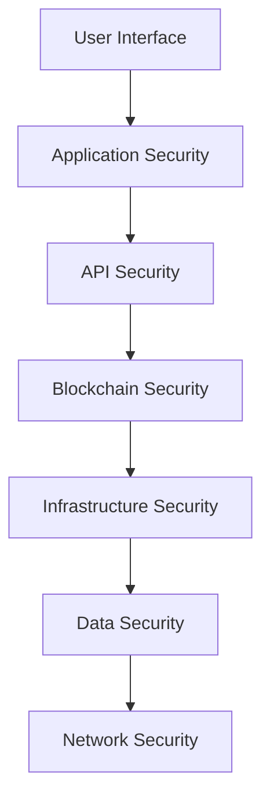

# Security Framework
# 安全框架

## 🛡️ Comprehensive Security Architecture

WeHour implements a multi-layer security framework that protects user data, prevents fraud, and ensures the integrity of the volunteer service tokenization ecosystem.

---

## 🏗️ Security Architecture Overview

**Defense in Depth**: Multiple security layers protect the platform from various threats, ensuring user safety, data integrity, and system reliability.

### Security Layers

---

## 🔐 Authentication & Authorization

### Multi-Factor Authentication
<ul>
<li><strong>Social Login:</strong> Google, Facebook, Apple ID integration</li>
<li><strong>Email/Password:</strong> Traditional authentication method</li>
<li><strong>2FA Support:</strong> Two-factor authentication for enhanced security</li>
<li><strong>Biometric Auth:</strong> Fingerprint and face recognition</li>
</ul>

### Role-Based Access Control
<ul>
<li><strong>Volunteer Access:</strong> Basic platform access and features</li>
<li><strong>Organization Access:</strong> Event management and volunteer tracking</li>
<li><strong>Sponsor Access:</strong> Campaign management and impact reporting</li>
<li><strong>Admin Access:</strong> Platform administration and monitoring</li>
</ul>

---

## 🔒 Data Protection

### Encryption Standards
<ul>
<li><strong>Data at Rest:</strong> AES-256 encryption for stored data</li>
<li><strong>Data in Transit:</strong> TLS 1.3 encryption for data transmission</li>
<li><strong>Key Management:</strong> Secure key storage and rotation</li>
<li><strong>End-to-End:</strong> End-to-end encryption for sensitive data</li>
</ul>

### Privacy Protection
<ul>
<li><strong>Data Minimization:</strong> Only necessary data collected and stored</li>
<li><strong>Consent Management:</strong> Granular control over data sharing</li>
<li><strong>Right to Deletion:</strong> Users can request data removal</li>
<li><strong>Anonymization:</strong> Personal data anonymized when possible</li>
</ul>

---

## 🛡️ Fraud Prevention

### Multi-Attestation System
<ul>
<li><strong>Multiple Verifiers:</strong> Independent confirmation of participation</li>
<li><strong>Time Validation:</strong> GPS and timestamp verification</li>
<li><strong>Role Verification:</strong> Confirmation of assigned responsibilities</li>
<li><strong>Quality Checks:</strong> Performance and impact assessment</li>
</ul>

### AI-Powered Fraud Detection
<ul>
<li><strong>Anomaly Detection:</strong> AI-powered fraud pattern recognition</li>
<li><strong>Behavioral Analysis:</strong> User behavior pattern analysis</li>
<li><strong>Risk Scoring:</strong> Dynamic risk assessment for transactions</li>
<li><strong>Real-Time Monitoring:</strong> Continuous fraud monitoring</li>
</ul>

---

## 🔗 Blockchain Security

### Smart Contract Security
<ul>
<li><strong>Code Audits:</strong> Professional security audits</li>
<li><strong>Access Controls:</strong> Role-based contract access</li>
<li><strong>Upgradeability:</strong> Secure contract upgrade mechanisms</li>
<li><strong>Emergency Functions:</strong> Emergency pause and recovery</li>
</ul>

### Transaction Security
<ul>
<li><strong>Digital Signatures:</strong> Cryptographic transaction signing</li>
<li><strong>Nonce Protection:</strong> Prevent transaction replay attacks</li>
<li><strong>Gas Limits:</strong> Prevent gas limit attacks</li>
<li><strong>Audit Trails:</strong> Complete transaction history</li>
</ul>

---

## 🌐 Network Security

### Infrastructure Security
<ul>
<li><strong>DDoS Protection:</strong> Distributed denial of service protection</li>
<li><strong>Firewall Security:</strong> Network firewall and intrusion detection</li>
<li><strong>SSL/TLS:</strong> Secure communication protocols</li>
<li><strong>Regular Updates:</strong> Security patches and updates</li>
</ul>

### API Security
<ul>
<li><strong>Rate Limiting:</strong> API usage limits and throttling</li>
<li><strong>Authentication:</strong> API key and token authentication</li>
<li><strong>Input Validation:</strong> Request validation and sanitization</li>
<li><strong>Monitoring:</strong> API usage monitoring and alerting</li>
</ul>

---

## 🔍 Monitoring & Detection

### Security Monitoring
<ul>
<li><strong>Real-Time Monitoring:</strong> Continuous security monitoring</li>
<li><strong>Alert Systems:</strong> Automated security alerts</li>
<li><strong>Log Analysis:</strong> Security log analysis and correlation</li>
<li><strong>Incident Response:</strong> Automated incident response</li>
</ul>

### Threat Detection
<ul>
<li><strong>Intrusion Detection:</strong> Network intrusion detection</li>
<li><strong>Malware Protection:</strong> Malware detection and prevention</li>
<li><strong>Vulnerability Scanning:</strong> Regular vulnerability assessments</li>
<li><strong>Penetration Testing:</strong> Regular security testing</li>
</ul>

---

## 🚨 Incident Response

### Response Framework
<ul>
<li><strong>Response Team:</strong> Dedicated security response team</li>
<li><strong>Response Procedures:</strong> Standardized incident response procedures</li>
<li><strong>Communication:</strong> Stakeholder communication protocols</li>
<li><strong>Recovery:</strong> System recovery and restoration procedures</li>
</ul>

### Recovery Procedures
<ul>
<li><strong>Backup Systems:</strong> Regular data backups and recovery</li>
<li><strong>Disaster Recovery:</strong> Disaster recovery planning and testing</li>
<li><strong>Business Continuity:</strong> Business continuity planning</li>
<li><strong>System Restoration:</strong> Rapid system restoration capabilities</li>
</ul>

---

## 🔒 Compliance & Regulation

### Regulatory Compliance
<ul>
<li><strong>GDPR Compliance:</strong> European data protection compliance</li>
<li><strong>CCPA Compliance:</strong> California privacy law compliance</li>
<li><strong>PDPA Compliance:</strong> Personal data protection compliance</li>
<li><strong>Industry Standards:</strong> Industry security standards compliance</li>
</ul>

### Audit & Reporting
<ul>
<li><strong>Regular Audits:</strong> Regular security audits and assessments</li>
<li><strong>Compliance Reporting:</strong> Regulatory compliance reporting</li>
<li><strong>Security Metrics:</strong> Security performance metrics</li>
<li><strong>Risk Assessment:</strong> Regular risk assessments</li>
</ul>

---

## 🛡️ User Security

### Wallet Security
<ul>
<li><strong>Custodial Wallets:</strong> Managed wallets for non-technical users</li>
<li><strong>Hardware Support:</strong> Hardware wallet integration</li>
<li><strong>Multi-Signature:</strong> Multi-signature wallet support</li>
<li><strong>Backup Systems:</strong> Wallet backup and recovery</li>
</ul>

### Account Security
<ul>
<li><strong>Password Security:</strong> Strong password requirements</li>
<li><strong>Session Management:</strong> Secure session management</li>
<li><strong>Account Lockout:</strong> Account lockout after failed attempts</li>
<li><strong>Security Notifications:</strong> Security event notifications</li>
</ul>

---

## 🔮 Future Security Enhancements

### Advanced Security Features
<ul>
<li><strong>AI Security:</strong> AI-powered security monitoring</li>
<li><strong>Quantum Security:</strong> Quantum-resistant cryptography</li>
<li><strong>Zero Trust:</strong> Zero trust security architecture</li>
<li><strong>Advanced Analytics:</strong> Enhanced security analytics</li>
</ul>

### Security Innovation
<ul>
<li><strong>Blockchain Security:</strong> Advanced blockchain security measures</li>
<li><strong>Privacy Technology:</strong> Enhanced privacy protection</li>
<li><strong>Threat Intelligence:</strong> Advanced threat intelligence</li>
<li><strong>Security Automation:</strong> Automated security responses</li>
</ul>

---

## 💡 Security Use Cases

### Volunteer Security
<ul>
<li><strong>Data Privacy:</strong> Personal data protection</li>
<li><strong>Account Security:</strong> Secure account management</li>
<li><strong>Transaction Security:</strong> Secure token transactions</li>
<li><strong>Identity Protection:</strong> Identity verification and protection</li>
</ul>

### Organization Security
<ul>
<li><strong>Data Security:</strong> Organization data protection</li>
<li><strong>Access Control:</strong> Role-based access management</li>
<li><strong>Audit Trails:</strong> Complete activity audit trails</li>
<li><strong>Compliance:</strong> Regulatory compliance support</li>
</ul>

### Platform Security
<ul>
<li><strong>System Security:</strong> Platform system protection</li>
<li><strong>Network Security:</strong> Network infrastructure protection</li>
<li><strong>Application Security:</strong> Application security measures</li>
<li><strong>Data Security:</strong> Platform data protection</li>
</ul>

---

## 📊 Security Metrics

### Security KPIs
<ul>
<li><strong>Security Incidents:</strong> Number and severity of security incidents</li>
<li><strong>Response Time:</strong> Average incident response time</li>
<li><strong>Recovery Time:</strong> Average system recovery time</li>
<li><strong>User Satisfaction:</strong> Security user satisfaction ratings</li>
</ul>

### Performance Indicators
- **Security Score**: Overall security performance rating
- **Compliance Rate**: Regulatory compliance percentage
- **Incident Rate**: Security incident frequency
- **User Trust**: User trust and confidence levels

---

## 🔒 Security Best Practices

### User Best Practices
<ul>
<li><strong>Strong Passwords:</strong> Use strong, unique passwords</li>
<li><strong>2FA Enablement:</strong> Enable two-factor authentication</li>
<li><strong>Regular Updates:</strong> Keep software and apps updated</li>
<li><strong>Phishing Awareness:</strong> Be aware of phishing attempts</li>
</ul>

### Organization Best Practices
<ul>
<li><strong>Access Management:</strong> Proper access control management</li>
<li><strong>Data Classification:</strong> Classify and protect data appropriately</li>
<li><strong>Regular Training:</strong> Regular security training for staff</li>
<li><strong>Incident Planning:</strong> Develop incident response plans</li>
</ul>

---

*WeHour's security framework provides comprehensive protection for the volunteer service tokenization platform. Through multi-layer security, fraud prevention, and compliance measures, the platform ensures user safety, data integrity, and system reliability while maintaining transparency and trust.*
