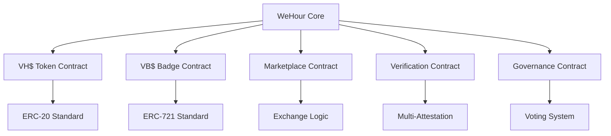

# Smart Contracts
# 智能合约

## 📝 Decentralized Logic Implementation

WeHour's smart contracts form the backbone of the platform, implementing the dual-token ecosystem, verification systems, and marketplace functionality with security, transparency, and efficiency.

---

## 🏗️ Contract Architecture

**Modular Design**: Smart contracts are designed with modularity, upgradability, and security in mind, enabling flexible functionality while maintaining decentralization.

### Contract Hierarchy

---

## 🪙 VH$ Token Contract

### Core Features

<h4>🪙 VH$ Contract Specifications</h4>
<ul>
<li><strong>Standard:</strong> ERC-20 compatible utility token</li>
<li><strong>Name:</strong> WeHours Token</li>
<li><strong>Symbol:</strong> VH$</li>
<li><strong>Decimals:</strong> 18 (standard precision)</li>
<li><strong>Total Supply:</strong> Unlimited (based on verified hours)</li>
</ul>

### Key Functions

<h4>⚙️ VH$ Functions</h4>
<ul>
<li><strong>mint():</strong> Issue tokens for verified volunteer hours</li>
<li><strong>burn():</strong> Destroy tokens when redeemed</li>
<li><strong>transfer():</strong> Standard token transfers</li>
<li><strong>approve():</strong> Third-party token spending</li>
<li><strong>roleMultiplier():</strong> Apply role-based multipliers</li>
</ul>

### Security Features

<h4>🛡️ VH$ Security</h4>
<ul>
<li><strong>Access Control:</strong> Role-based minting permissions</li>
<li><strong>Rate Limiting:</strong> Prevent excessive token issuance</li>
<li><strong>Fraud Detection:</strong> Anomaly detection and prevention</li>
<li><strong>Audit Trails:</strong> Complete transaction history</li>
</ul>

---

## 🏆 VB$ Badge Contract

### Core Features

<h4>🏆 VB$ Contract Specifications</h4>
<ul>
<li><strong>Standard:</strong> ERC-721 compatible Soulbound Token</li>
<li><strong>Type:</strong> Non-fungible token (NFT)</li>
<li><strong>Transferability:</strong> Non-transferable (soulbound)</li>
<li><strong>Metadata:</strong> Rich event and role information</li>
<li><strong>Revocation:</strong> Possible for fraud or misconduct</li>
</ul>

### Key Functions

<h4>⚙️ VB$ Functions</h4>
<ul>
<li><strong>mintBadge():</strong> Issue badges for event participation</li>
<li><strong>revokeBadge():</strong> Revoke badges for misconduct</li>
<li><strong>verifyBadge():</strong> Verify badge authenticity</li>
<li><strong>updateMetadata():</strong> Update badge information</li>
<li><strong>getBadgeInfo():</strong> Retrieve badge details</li>
</ul>

### Soulbound Properties

<h4>🔒 Soulbound Features</h4>
<ul>
<li><strong>Non-Transferable:</strong> Tokens permanently bound to recipient</li>
<li><strong>Identity Proof:</strong> Represents authentic participation</li>
<li><strong>Fraud Prevention:</strong> Prevents credential trading</li>
<li><strong>Permanent Binding:</strong> Cannot be sold or transferred</li>
</ul>

---

## 🛒 Marketplace Contract

### Exchange Logic

<h4>🔄 Marketplace Functions</h4>
<ul>
<li><strong>createListing():</strong> Create reward listings</li>
<li><strong>redeemReward():</strong> Redeem VH$ for rewards</li>
<li><strong>processDonation():</strong> Convert VH$ to donations</li>
<li><strong>updateListing():</strong> Modify reward listings</li>
<li><strong>cancelListing():</strong> Remove reward listings</li>
</ul>

### Reward Management

<h4>💰 Reward System</h4>
<ul>
<li><strong>Coupon Redemption:</strong> VH$ to coupon conversion</li>
<li><strong>Donation Processing:</strong> VH$ to donation conversion</li>
<li><strong>Sponsor Integration:</strong> Corporate reward programs</li>
<li><strong>Retailer Partnerships:</strong> Retail reward integration</li>
</ul>

---

## ✅ Verification Contract

### Multi-Attestation System

<h4>🔍 Verification Functions</h4>
<ul>
<li><strong>attestParticipation():</strong> Record volunteer participation</li>
<li><strong>verifyAttestation():</strong> Confirm attestation validity</li>
<li><strong>revokeAttestation():</strong> Revoke fraudulent attestations</li>
<li><strong>getAttestations():</strong> Retrieve attestation history</li>
<li><strong>validateProof():</strong> Validate participation proof</li>
</ul>

### Verification Logic

<h4>✅ Verification Process</h4>
<ul>
<li><strong>Multi-Source:</strong> Multiple verifiers required</li>
<li><strong>Time Validation:</strong> GPS and timestamp verification</li>
<li><strong>Role Confirmation:</strong> Verify assigned responsibilities</li>
<li><strong>Quality Assessment:</strong> Performance and impact evaluation</li>
</ul>

---

## 🏛️ Governance Contract

### Voting System

<h4>🗳️ Governance Functions</h4>
<ul>
<li><strong>createProposal():</strong> Submit governance proposals</li>
<li><strong>vote():</strong> Cast votes on proposals</li>
<li><strong>executeProposal():</strong> Execute approved proposals</li>
<li><strong>delegateVotes():</strong> Delegate voting power</li>
<li><strong>getProposal():</strong> Retrieve proposal details</li>
</ul>

### Governance Features

<h4>🏛️ Governance System</h4>
<ul>
<li><strong>Proposal Creation:</strong> Community-driven proposals</li>
<li><strong>Voting Mechanism:</strong> Token-weighted voting</li>
<li><strong>Execution Logic:</strong> Automated proposal execution</li>
<li><strong>Transparency:</strong> Public voting records</li>
</ul>

---

## 🔐 Security Implementation

### Access Control

<h4>🔒 Access Management</h4>
<ul>
<li><strong>Role-Based Access:</strong> Different permissions for different roles</li>
<li><strong>Multi-Signature:</strong> Multiple signatures for critical operations</li>
<li><strong>Time Locks:</strong> Delayed execution for sensitive operations</li>
<li><strong>Emergency Pause:</strong> Ability to pause contract operations</li>
</ul>

### Fraud Prevention

<h4>🛡️ Anti-Fraud Measures</h4>
<ul>
<li><strong>Rate Limiting:</strong> Prevent excessive token issuance</li>
<li><strong>Anomaly Detection:</strong> AI-powered fraud detection</li>
<li><strong>Community Reporting:</strong> Peer reporting of misconduct</li>
<li><strong>Audit Trails:</strong> Complete transaction history</li>
</ul>

---

## 🔄 Contract Interactions

### Inter-Contract Communication

<h4>🔗 Contract Integration</h4>
<ul>
<li><strong>Token Issuance:</strong> VH$ and VB$ coordinated issuance</li>
<li><strong>Verification Flow:</strong> Verification triggers token issuance</li>
<li><strong>Marketplace Integration:</strong> Seamless reward redemption</li>
<li><strong>Governance Updates:</strong> Community-driven contract updates</li>
</ul>

### Event Synchronization

<h4>📡 Event System</h4>
<ul>
<li><strong>Token Events:</strong> Mint, burn, and transfer events</li>
<li><strong>Verification Events:</strong> Attestation and verification events</li>
<li><strong>Marketplace Events:</strong> Listing and redemption events</li>
<li><strong>Governance Events:</strong> Proposal and voting events</li>
</ul>

---

## 📊 Contract Analytics

### Performance Metrics

<h4>📈 Contract Metrics</h4>
<ul>
<li><strong>Transaction Volume:</strong> Contract interaction frequency</li>
<li><strong>Gas Usage:</strong> Gas consumption optimization</li>
<li><strong>Success Rate:</strong> Transaction success percentage</li>
<li><strong>User Activity:</strong> Active contract users</li>
</ul>

### Health Monitoring

<h4>🔍 Health Tracking</h4>
<ul>
<li><strong>Contract State:</strong> Real-time contract state monitoring</li>
<li><strong>Error Tracking:</strong> Contract error detection and logging</li>
<li><strong>Performance Analysis:</strong> Contract performance optimization</li>
<li><strong>Security Monitoring:</strong> Security event detection</li>
</ul>

---

## 🚀 Contract Upgrades

### Upgradeability

<h4>🔄 Upgrade System</h4>
<ul>
<li><strong>Proxy Pattern:</strong> Upgradeable contract implementation</li>
<li><strong>Version Control:</strong> Contract version management</li>
<li><strong>Migration Support:</strong> Seamless contract migration</li>
<li><strong>Backward Compatibility:</strong> Maintain existing functionality</li>
</ul>

### Governance Updates

<h4>🏛️ Community Updates</h4>
<ul>
<li><strong>Proposal System:</strong> Community-driven updates</li>
<li><strong>Voting Mechanism:</strong> Token-holder voting</li>
<li><strong>Execution Logic:</strong> Automated update execution</li>
<li><strong>Transparency:</strong> Public update process</li>
</ul>

---

## 💡 Contract Use Cases

### Volunteer Scenarios

<h4>👨‍🎓 Student Volunteer</h4>
<ul>
<li><strong>Event Participation:</strong> VB$ badge minted for event</li>
<li><strong>Hour Tracking:</strong> VH$ tokens issued for hours</li>
<li><strong>Reward Redemption:</strong> VH$ converted to rewards</li>
<li><strong>Credential Verification:</strong> VB$ verified by employers</li>
</ul>

### Organization Scenarios

<h4>🏢 NGO Operations</h4>
<ul>
<li><strong>Event Creation:</strong> Events created and managed</li>
<li><strong>Volunteer Tracking:</strong> Volunteer participation tracked</li>
<li><strong>Impact Measurement:</strong> Social impact quantified</li>
<li><strong>Funding Opportunities:</strong> Enhanced funding through verification</li>
</ul>

### Sponsor Scenarios

<h4>💰 Corporate Engagement</h4>
<ul>
<li><strong>Campaign Creation:</strong> Branded volunteer campaigns</li>
<li><strong>Impact Verification:</strong> Transparent impact measurement</li>
<li><strong>ROI Analysis:</strong> Return on social investment</li>
<li><strong>Community Engagement:</strong> Direct volunteer community connection</li>
</ul>

---

## 🔮 Future Enhancements

### Advanced Features

<h4>🚀 Planned Features</h4>
<ul>
<li><strong>AI Integration:</strong> Machine learning for fraud detection</li>
<li><strong>Cross-Chain Support:</strong> Multi-network contract deployment</li>
<li><strong>Advanced Analytics:</strong> Enhanced contract analytics</li>
<li><strong>Automation:</strong> Automated contract operations</li>
</ul>

### Innovation Areas

<h4>💡 Innovation Focus</h4>
<ul>
<li><strong>Gas Optimization:</strong> Reduced transaction costs</li>
<li><strong>Performance Enhancement:</strong> Faster contract execution</li>
<li><strong>Security Improvements:</strong> Enhanced security measures</li>
<li><strong>User Experience:</strong> Simplified contract interactions</li>
</ul>

---

## 🔒 Security & Compliance

### Security Measures

<h4>🛡️ Security Features</h4>
<ul>
<li><strong>Code Audits:</strong> Professional security audits</li>
<li><strong>Access Controls:</strong> Role-based access management</li>
<li><strong>Emergency Functions:</strong> Emergency pause and recovery</li>
<li><strong>Fraud Detection:</strong> AI-powered anomaly detection</li>
</ul>

### Compliance Features

<h4>⚖️ Compliance Measures</h4>
<ul>
<li><strong>Regulatory Alignment:</strong> Compliance with local regulations</li>
<li><strong>Audit Trails:</strong> Complete transaction history</li>
<li><strong>Transparency:</strong> Public contract code and operations</li>
<li><strong>Governance:</strong> Community-driven decision making</li>
</ul>

---

*WeHour's smart contracts provide the decentralized foundation for the volunteer service tokenization platform. Through modular design, security-first implementation, and community governance, the contracts enable transparent, verifiable, and efficient volunteer service recognition while maintaining decentralization and user control.*
