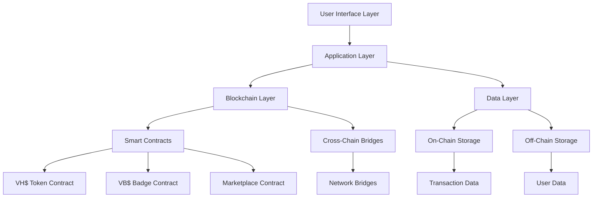

# System Overview
# 系统概述

## 🏗️ WeHour Technical Architecture

WeHour is built on a robust, scalable blockchain infrastructure that supports the dual-token ecosystem while providing zero-crypto user experience and cross-chain interoperability.

---

## 🎯 Architecture Principles

**Blockchain-First Design**: Built on decentralized infrastructure with centralized user experience, ensuring security and transparency while maintaining accessibility.

### Core Design Principles
- **Decentralized Infrastructure**: Blockchain-based security and transparency
- **Centralized UX**: Zero-crypto user experience for mainstream adoption
- **Cross-Chain Compatibility**: Multi-network support for global accessibility
- **Scalable Architecture**: Designed for growth and expansion

---

## 🏗️ System Architecture

### High-Level Architecture

### Component Overview

<ul>
<li><strong>Web Application:</strong> Organization dashboard and sponsor portal</li>
<li><strong>Mobile App:</strong> Volunteer mobile application</li>
<li><strong>API Gateway:</strong> Unified API for all interfaces</li>
<li><strong>Admin Panel:</strong> Platform administration and monitoring</li>
</ul>

<ul>
<li><strong>Business Logic:</strong> Core platform functionality</li>
<li><strong>Authentication:</strong> User authentication and authorization</li>
<li><strong>Integration Services:</strong> Third-party integrations</li>
<li><strong>Notification System:</strong> Real-time notifications</li>
</ul>

<ul>
<li><strong>Smart Contracts:</strong> VH$ and VB$ token contracts</li>
<li><strong>Cross-Chain Bridges:</strong> Multi-network interoperability</li>
<li><strong>Verification System:</strong> Multi-attestation verification</li>
<li><strong>Gas Management:</strong> Cost optimization and fee handling</li>
</ul>

<ul>
<li><strong>On-Chain Data:</strong> Immutable transaction records</li>
<li><strong>Off-Chain Data:</strong> User data and metadata</li>
<li><strong>Cache Layer:</strong> Performance optimization</li>
<li><strong>Backup Systems:</strong> Data redundancy and recovery</li>
</ul>

---

## 🔗 Blockchain Infrastructure

### Primary Networks
<ul>
<li><strong>Networks:</strong> Polygon, Arbitrum, Optimism</li>
<li><strong>Gas Cost:</strong> $0.01 - $0.05 per transaction</li>
<li><strong>Speed:</strong> 2-5 second confirmation</li>
<li><strong>Security:</strong> High security, decentralized</li>
<li><strong>Use Case:</strong> Premium credentials and rewards</li>
</ul>

<ul>
<li><strong>Network:</strong> Binance Smart Chain</li>
<li><strong>Gas Cost:</strong> $0.001 - $0.01 per transaction</li>
<li><strong>Speed:</strong> 3 second confirmation</li>
<li><strong>Security:</strong> High throughput, lower cost</li>
<li><strong>Use Case:</strong> Mass adoption and high-volume transactions</li>
</ul>

### Cross-Chain Architecture
<ul>
<li><strong>Token Bridges:</strong> Secure VH$ transfers between networks</li>
<li><strong>Credential Bridges:</strong> VB$ badge verification across chains</li>
<li><strong>Data Synchronization:</strong> Metadata and verification data sync</li>
<li><strong>Smart Contract Bridges:</strong> Cross-chain contract execution</li>
</ul>

---

## 📱 User Interface Architecture

### Zero-Crypto Experience
<ul>
<li><strong>Traditional UX:</strong> Familiar app interface hiding blockchain complexity</li>
<li><strong>Social Login:</strong> Easy onboarding with existing accounts</li>
<li><strong>Custodial Wallets:</strong> Managed wallets for non-technical users</li>
<li><strong>Progressive Disclosure:</strong> Advanced features available for power users</li>
</ul>

### Platform Components
<ul>
<li><strong>Organization Dashboard:</strong> Event management and volunteer tracking</li>
<li><strong>Volunteer Mobile App:</strong> Participation and reward management</li>
<li><strong>Sponsor Portal:</strong> Campaign management and impact reporting</li>
<li><strong>Marketplace Interface:</strong> Reward redemption and donation</li>
</ul>

---

## 🔐 Security Architecture

### Multi-Layer Security
<ul>
<li><strong>Blockchain Security:</strong> Immutable, tamper-proof records</li>
<li><strong>Smart Contract Security:</strong> Audited, secure contract code</li>
<li><strong>Application Security:</strong> Secure API and user authentication</li>
<li><strong>Infrastructure Security:</strong> Secure hosting and data protection</li>
</ul>

### Fraud Prevention
<ul>
<li><strong>Multi-Attestation:</strong> Multiple verifiers confirm participation</li>
<li><strong>Time Validation:</strong> GPS and timestamp verification</li>
<li><strong>Behavioral Analysis:</strong> AI-powered fraud detection</li>
<li><strong>Community Reporting:</strong> Peer reporting of suspicious activity</li>
</ul>

---

## 💾 Data Architecture

### On-Chain Data
<ul>
<li><strong>Transaction Records:</strong> Immutable transaction history</li>
<li><strong>Token Balances:</strong> VH$ and VB$ token balances</li>
<li><strong>Verification Data:</strong> Multi-attestation signatures</li>
<li><strong>Smart Contract State:</strong> Contract logic and state</li>
</ul>

### Off-Chain Data
<ul>
<li><strong>User Profiles:</strong> Personal information and preferences</li>
<li><strong>Event Data:</strong> Event details and metadata</li>
<li><strong>Analytics Data:</strong> Usage statistics and insights</li>
<li><strong>Integration Data:</strong> Third-party service data</li>
</ul>

---

## 🔄 Integration Architecture

### Third-Party Integrations
<ul>
<li><strong>School Systems:</strong> Student information system integration</li>
<li><strong>Employer APIs:</strong> HR system integration for verification</li>
<li><strong>Retailer POS:</strong> Point-of-sale system integration</li>
<li><strong>Payment Systems:</strong> Payment processing and settlement</li>
</ul>

### API Architecture
<ul>
<li><strong>RESTful APIs:</strong> Standard HTTP-based APIs</li>
<li><strong>GraphQL Support:</strong> Flexible data querying</li>
<li><strong>WebSocket Support:</strong> Real-time updates and notifications</li>
<li><strong>Rate Limiting:</strong> API usage limits and throttling</li>
</ul>

---

## 📊 Monitoring & Analytics

### System Monitoring
<ul>
<li><strong>Performance Monitoring:</strong> System performance and response times</li>
<li><strong>Error Tracking:</strong> Error detection and logging</li>
<li><strong>Security Monitoring:</strong> Security event detection and response</li>
<li><strong>User Analytics:</strong> User behavior and engagement tracking</li>
</ul>

### Business Analytics
<ul>
<li><strong>Token Analytics:</strong> VH$ and VB$ usage and circulation</li>
<li><strong>User Engagement:</strong> Volunteer and organization activity</li>
<li><strong>Impact Measurement:</strong> Social impact and outcomes</li>
<li><strong>Revenue Analytics:</strong> Revenue streams and profitability</li>
</ul>

---

## 🚀 Scalability Architecture

### Horizontal Scaling
<ul>
<li><strong>Microservices:</strong> Modular, scalable service architecture</li>
<li><strong>Load Balancing:</strong> Traffic distribution and management</li>
<li><strong>Database Sharding:</strong> Database performance optimization</li>
<li><strong>CDN Integration:</strong> Content delivery network optimization</li>
</ul>

### Performance Optimization
<ul>
<li><strong>Caching Systems:</strong> Redis and CDN caching</li>
<li><strong>Database Optimization:</strong> Query optimization and indexing</li>
<li><strong>API Optimization:</strong> Response time and throughput optimization</li>
<li><strong>Blockchain Optimization:</strong> Gas optimization and batch operations</li>
</ul>

---

## 🔮 Future Architecture

### Planned Enhancements
<ul>
<li><strong>AI Integration:</strong> Machine learning for fraud detection and optimization</li>
<li><strong>IoT Integration:</strong> Internet of Things device integration</li>
<li><strong>Advanced Analytics:</strong> Predictive analytics and insights</li>
<li><strong>Mobile Optimization:</strong> Enhanced mobile user experience</li>
</ul>

### Technology Evolution
<ul>
<li><strong>Layer 2 Solutions:</strong> Enhanced scalability and cost efficiency</li>
<li><strong>Cross-Chain Protocols:</strong> Advanced cross-chain interoperability</li>
<li><strong>Privacy Enhancements:</strong> Enhanced privacy and data protection</li>
<li><strong>Performance Improvements:</strong> Continuous performance optimization</li>
</ul>

---

## 💡 Architecture Benefits

### Technical Benefits
<ul>
<li><strong>Scalability:</strong> Designed for growth and expansion</li>
<li><strong>Security:</strong> Multi-layer security architecture</li>
<li><strong>Reliability:</strong> High availability and fault tolerance</li>
<li><strong>Performance:</strong> Optimized for speed and efficiency</li>
</ul>

### Business Benefits
<ul>
<li><strong>Cost Efficiency:</strong> Optimized infrastructure costs</li>
<li><strong>User Experience:</strong> Zero-crypto user experience</li>
<li><strong>Global Reach:</strong> Cross-chain interoperability</li>
<li><strong>Innovation:</strong> Cutting-edge technology adoption</li>
</ul>

---

*WeHour's technical architecture provides a robust, scalable foundation for the volunteer service tokenization platform. Through blockchain-first design, zero-crypto user experience, and cross-chain interoperability, the system enables global volunteer service recognition while maintaining security, transparency, and accessibility.*
