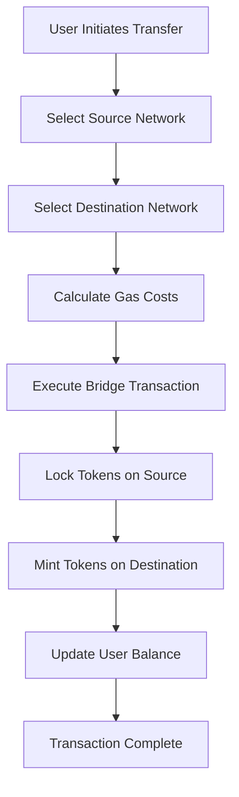
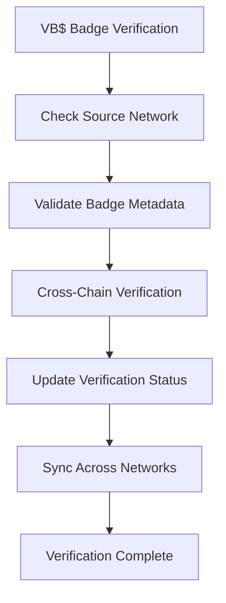

# Cross-Chain Architecture

## 🌐 Multi-Chain Token Ecosystem

WeHour's cross-chain architecture enables VH$ and VB$ tokens to operate seamlessly across multiple blockchain networks, providing global accessibility, cost efficiency, and enhanced functionality.

---

## 🏗️ Architecture Overview

**Multi-Chain Design**: VH$ and VB$ tokens operate across multiple blockchains with seamless interoperability, enabling global volunteer service recognition and utility.

### Core Principles
- **Network Agnostic**: Tokens work on any supported blockchain
- **Seamless Transfers**: Cross-chain token and credential transfers
- **Cost Optimization**: Automatic network selection for efficiency
- **Global Accessibility**: Worldwide volunteer service recognition

---

## 🔗 Supported Networks

### Primary Networks

<ul>
<li><strong>Networks:</strong> Polygon, Arbitrum, Optimism</li>
<li><strong>Gas Cost:</strong> $0.01 - $0.05 per transaction</li>
<li><strong>Speed:</strong> 2-5 second confirmation</li>
<li><strong>Security:</strong> High security, decentralized</li>
<li><strong>Use Case:</strong> Premium credentials and rewards</li>
</ul>

<ul>
<li><strong>Network:</strong> Binance Smart Chain</li>
<li><strong>Gas Cost:</strong> $0.001 - $0.01 per transaction</li>
<li><strong>Speed:</strong> 3 second confirmation</li>
<li><strong>Security:</strong> High throughput, lower cost</li>
<li><strong>Use Case:</strong> Mass adoption and high-volume transactions</li>
</ul>

<ul>
<li><strong>Planned:</strong> Avalanche, Solana, Cardano</li>
<li><strong>Benefits:</strong> Enhanced scalability and speed</li>
<li><strong>Integration:</strong> Seamless cross-chain transfers</li>
<li><strong>Accessibility:</strong> Global volunteer participation</li>
<li><strong>Use Case:</strong> Specialized use cases and enhanced features</li>
</ul>

---

## 🔄 Cross-Chain Token Mechanics

### VH$ Cross-Chain Functionality
<ul>
<li><strong>Unified Supply:</strong> Total VH$ supply across all networks</li>
<li><strong>Seamless Transfers:</strong> Move VH$ between networks instantly</li>
<li><strong>Network Optimization:</strong> Automatic routing for cost efficiency</li>
<li><strong>Global Utility:</strong> Use VH$ on any supported network</li>
</ul>

### VB$ Cross-Chain Functionality
<ul>
<li><strong>Credential Portability:</strong> VB$ badges recognized across all networks</li>
<li><strong>Verification Consistency:</strong> Same verification process on all networks</li>
<li><strong>Metadata Preservation:</strong> Rich metadata maintained across chains</li>
<li><strong>Global Recognition:</strong> International credential acceptance</li>
</ul>

---

## 🌉 Bridge Architecture

### Cross-Chain Bridges
<ul>
<li><strong>Token Bridges:</strong> Secure VH$ transfers between networks</li>
<li><strong>Credential Bridges:</strong> VB$ badge verification across chains</li>
<li><strong>Data Bridges:</strong> Metadata and verification data synchronization</li>
<li><strong>Smart Contract Bridges:</strong> Cross-chain smart contract execution</li>
</ul>

### Bridge Security
<ul>
<li><strong>Multi-Signature:</strong> Multiple signatures required for bridge operations</li>
<li><strong>Time Locks:</strong> Delayed execution for large transfers</li>
<li><strong>Audit Trails:</strong> Complete transaction history across bridges</li>
<li><strong>Fraud Detection:</strong> AI-powered anomaly detection</li>
</ul>

---

## 🔄 Cross-Chain Workflows

### Token Transfer Process

### Credential Verification Process

---

## 💰 Cost Optimization

### Gas Fee Management
<ul>
<li><strong>Network Selection:</strong> Automatic selection of lowest-cost network</li>
<li><strong>Batch Operations:</strong> Group multiple transactions for efficiency</li>
<li><strong>Gas Estimation:</strong> Real-time gas cost calculation</li>
<li><strong>Fee Sponsorship:</strong> Sponsor-paid gas fees for volunteers</li>
</ul>

### Transaction Routing
<ul>
<li><strong>Cost Analysis:</strong> Compare gas costs across networks</li>
<li><strong>Speed Optimization:</strong> Balance cost vs. speed requirements</li>
<li><strong>Network Health:</strong> Monitor network congestion and performance</li>
<li><strong>User Preferences:</strong> Allow users to set routing preferences</li>
</ul>

---

## 🌍 Global Accessibility

### Regional Network Optimization
<ul>
<li><strong>Asia-Pacific:</strong> BSC for cost efficiency, Ethereum L2 for premium</li>
<li><strong>North America:</strong> Ethereum L2 for security, BSC for volume</li>
<li><strong>Europe:</strong> Ethereum L2 for compliance, future networks for innovation</li>
<li><strong>Global:</strong> Multi-network support for worldwide access</li>
</ul>

### Localization Features
<ul>
<li><strong>Language Support:</strong> Multi-language interfaces</li>
<li><strong>Currency Integration:</strong> Local currency conversion</li>
<li><strong>Regulatory Compliance:</strong> Network-specific compliance features</li>
<li><strong>Cultural Adaptation:</strong> Region-specific reward systems</li>
</ul>

---

## 🔐 Security Framework

### Cross-Chain Security
<ul>
<li><strong>Multi-Signature Wallets:</strong> Enhanced security for cross-chain operations</li>
<li><strong>Time-Locked Transfers:</strong> Delayed execution for large transfers</li>
<li><strong>Audit Trails:</strong> Complete transaction history across networks</li>
<li><strong>Fraud Detection:</strong> AI-powered anomaly detection</li>
</ul>

### Privacy Protection
<ul>
<li><strong>Data Minimization:</strong> Only necessary data stored on each network</li>
<li><strong>Encryption:</strong> Sensitive data encrypted across networks</li>
<li><strong>Consent Management:</strong> Granular control over cross-chain data sharing</li>
<li><strong>Right to Deletion:</strong> Data removal across all networks</li>
</ul>

---

## 📊 Cross-Chain Analytics

### Network Performance Metrics
<ul>
<li><strong>Transaction Volume:</strong> VH$ and VB$ transactions per network</li>
<li><strong>Gas Costs:</strong> Average gas costs across networks</li>
<li><strong>Speed Metrics:</strong> Transaction confirmation times</li>
<li><strong>User Distribution:</strong> User activity across networks</li>
</ul>

### Cross-Chain Analytics
<ul>
<li><strong>Token Flow:</strong> VH$ and VB$ movement between networks</li>
<li><strong>User Behavior:</strong> Cross-chain usage patterns</li>
<li><strong>Network Health:</strong> Performance and reliability metrics</li>
<li><strong>Optimization Insights:</strong> Recommendations for cost and speed</li>
</ul>

---

## 🚀 Future Enhancements

### Advanced Cross-Chain Features
<ul>
<li><strong>Atomic Swaps:</strong> Direct token exchanges between networks</li>
<li><strong>Cross-Chain Staking:</strong> Stake tokens across multiple networks</li>
<li><strong>Interoperability Standards:</strong> Industry-standard cross-chain protocols</li>
<li><strong>AI-Powered Routing:</strong> Intelligent network selection</li>
</ul>

### Network Expansion
<ul>
<li><strong>New Networks:</strong> Support for emerging blockchain networks</li>
<li><strong>Specialized Networks:</strong> Purpose-built networks for specific use cases</li>
<li><strong>Layer 2 Solutions:</strong> Enhanced scalability and cost efficiency</li>
<li><strong>Interoperability Protocols:</strong> Standardized cross-chain communication</li>
</ul>

---

## 💡 Use Case Examples

### Global Volunteer
<ul>
<li><strong>Hong Kong Event:</strong> Earns VB$ badge on Ethereum L2</li>
<li><strong>Singapore Event:</strong> Earns VB$ badge on BSC</li>
<li><strong>Cross-Chain Verification:</strong> All badges recognized globally</li>
<li><strong>VH$ Usage:</strong> Tokens usable across all networks</li>
</ul>

### Corporate Sponsor
<ul>
<li><strong>Premium Campaigns:</strong> High-value campaigns on Ethereum L2</li>
<li><strong>Mass Campaigns:</strong> High-volume campaigns on BSC</li>
<li><strong>Cross-Chain Analytics:</strong> Unified reporting across networks</li>
<li><strong>Global Reach:</strong> Worldwide volunteer engagement</li>
</ul>

### Organization Impact
<ul>
<li><strong>Local Events:</strong> BSC for cost-efficient local events</li>
<li><strong>International Events:</strong> Ethereum L2 for global recognition</li>
<li><strong>Cross-Chain Data:</strong> Unified volunteer and impact data</li>
<li><strong>Global Recognition:</strong> Credentials recognized worldwide</li>
</ul>

---

## 🔧 Technical Implementation

### Smart Contract Architecture
<ul>
<li><strong>Standardized Interfaces:</strong> Consistent contract interfaces across networks</li>
<li><strong>Upgradeable Contracts:</strong> Ability to upgrade contracts without migration</li>
<li><strong>Cross-Chain Communication:</strong> Secure communication between networks</li>
<li><strong>Event Synchronization:</strong> Real-time event updates across networks</li>
</ul>

### Bridge Implementation
<ul>
<li><strong>Lock-and-Mint:</strong> Lock tokens on source, mint on destination</li>
<li><strong>Burn-and-Mint:</strong> Burn tokens on source, mint on destination</li>
<li><strong>Atomic Swaps:</strong> Direct token exchanges between networks</li>
<li><strong>State Channels:</strong> Off-chain state management for efficiency</li>
</ul>

---

## 📈 Success Metrics

### Cross-Chain KPIs
<ul>
<li><strong>Cross-Chain Volume:</strong> Total VH$ and VB$ transfers between networks</li>
<li><strong>Network Distribution:</strong> User and transaction distribution across networks</li>
<li><strong>Cost Efficiency:</strong> Average gas costs and optimization savings</li>
<li><strong>User Adoption:</strong> Cross-chain feature usage and engagement</li>
</ul>

### Performance Indicators
- **Transaction Speed**: Average cross-chain transfer times
- **Cost Savings**: Gas cost optimization benefits
- **User Satisfaction**: Cross-chain user experience ratings
- **Network Health**: Performance and reliability across networks

---

*WeHour's cross-chain architecture enables global volunteer service recognition and utility, creating a truly international ecosystem where volunteers, organizations, and sponsors can interact seamlessly regardless of their location or preferred blockchain network.*
