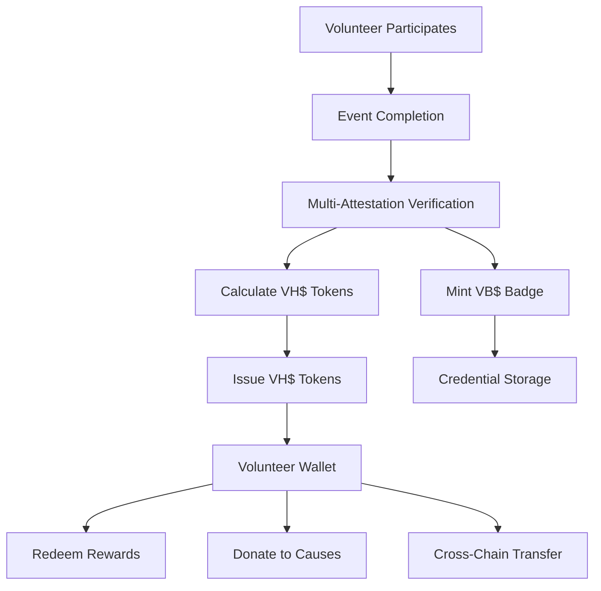

# Dual-Token Model

## 🪙 The WeHour Token Ecosystem
## WeHour代币生态系统

WeHour employs a sophisticated dual-token model that separates utility from credentials, creating a robust economic system that serves different purposes while working together seamlessly.
WeHour采用复杂的双代币模型，将效用与凭证分离，创建一个强大的经济系统，服务于不同目的，同时无缝协作。

### Cross-Merchant Stable Coin Integration
### 跨商家稳定币整合

**Universal Exchange Medium**: VH$ tokens can be converted to stable coins for cross-merchant consumption, enabling users to spend their volunteer hours across different merchant networks.
**通用交换媒介**：VH$代币可转换为稳定币用于跨商家消费，使用户能够在不同商家网络中消费其义工时数。

### Stable Coin Conversion Process
### 稳定币转换流程

<h4>🔄 Conversion Mechanism</h4>
<h4>转换机制</h4>
<ul>
<li><strong>VH$ to Stable Coin:</strong> Convert volunteer hours to stable coins for cross-merchant use</li>
<li><strong>Point Integration:</strong> Integrate with existing merchant point systems</li>
<li><strong>Cross-Merchant Spending:</strong> Use stable coins across different merchant networks</li>
<li><strong>Value Preservation:</strong> Maintain value across different ecosystems</li>
</ul>
<ul>
<li><strong>VH$转稳定币</strong>：将义工时数转换为稳定币用于跨商家使用</li>
<li><strong>积分整合</strong>：与现有商家积分系统整合</li>
<li><strong>跨商家消费</strong>：在不同商家网络中使用稳定币</li>
<li><strong>价值保持</strong>：在不同生态系统中保持价值</li>
</ul>

---

## 🏗️ Architecture Overview

**Two Complementary Tokens**: VH$ (WeHours Token) for utility and rewards + VB$ (Badge Token) for credentials and proof of participation

### Token Relationship Matrix

| Aspect | VH$ (WeHours Token) | VB$ (Badge Token) |
|--------|-------------------|-------------------|
| **Purpose** | Utility & Rewards | Credentials & Proof |
| **Type** | ERC-20 Utility Token | Soulbound Token (SBT) |
| **Transferability** | Transferable | Non-transferable |
| **Issuance** | Per verified hour | Per event participation |
| **Expiration** | No expiration | Non-expiring |
| **Value** | Economic utility | Social proof |
| **Use Cases** | Rewards, donations, purchases | Verification, credentials, proof |

---

## 🔄 Token Interaction Flow

---

## 🪙 VH$ (WeHours Token) - Utility Token

### Core Characteristics

<h4>🪙 VH$ Token Specifications</h4>
<ul>
<li><strong>Standard:</strong> ERC-20 compatible utility token</li>
<li><strong>Issuance Rate:</strong> 1 VH$ = 1 verified volunteer hour</li>
<li><strong>Role Multipliers:</strong> Leadership roles earn 1.5x tokens</li>
<li><strong>Transferability:</strong> Fully transferable between users</li>
<li><strong>Cross-Chain:</strong> Compatible across multiple blockchains</li>
<li><strong>Total Supply:</strong> Unlimited (based on verified hours)</li>
</ul>

### Economic Model
- **Base Rate**: 1 VH$ per verified hour
- **Role Multipliers**:
  - Standard Volunteer: 1.0x
  - Team Leader: 1.5x
  - Event Coordinator: 2.0x
  - Specialized Skills: 1.2x - 1.8x
- **Quality Bonuses**: Additional tokens for exceptional service
- **Retention Rewards**: Long-term volunteer loyalty bonuses

### Utility Functions

<h4>💰 Reward Redemption</h4>
<ul>
<li>Convert VH$ to retailer coupons and discounts</li>
<li>Exchange for gift cards and vouchers</li>
<li>Redeem for exclusive experiences and services</li>
<li>Access to premium volunteer opportunities</li>
</ul>

<h4>💝 Donation Power</h4>
<ul>
<li>Direct donations to supported causes</li>
<li>Matching donation programs with sponsors</li>
<li>Community impact fund contributions</li>
<li>Emergency relief fund donations</li>
</ul>

<h4>🌍 Cross-Chain Utility</h4>
<ul>
<li>Transfer tokens across supported blockchains</li>
<li>Participate in cross-chain reward programs</li>
<li>Access global volunteer opportunities</li>
<li>International recognition and benefits</li>
</ul>

---

## 🏆 VB$ (Badge Token) - Credential Token

### Core Characteristics

<h4>🏆 VB$ Token Specifications</h4>
<ul>
<li><strong>Standard:</strong> Soulbound Token (SBT) - ERC-721 compatible</li>
<li><strong>Issuance:</strong> 1 VB$ per event participation</li>
<li><strong>Transferability:</strong> Non-transferable (soulbound)</li>
<li><strong>Expiration:</strong> Non-expiring</li>
<li><strong>Revocation:</strong> Possible for fraud or misconduct</li>
<li><strong>Metadata:</strong> Rich event and role information</li>
</ul>

### Credential Structure
- **Event Information**: Date, location, organization, cause
- **Role Details**: Specific responsibilities and contributions
- **Impact Metrics**: Hours served, people helped, outcomes achieved
- **Verification Data**: Attestation signatures and verification methods
- **Skills Demonstrated**: Competencies and capabilities shown

### Verification Features

<h4>🔍 QR Code Verification</h4>
<ul>
<li>Instant verification for employers and institutions</li>
<li>Public verification without revealing personal data</li>
<li>Cross-platform credential recognition</li>
<li>Mobile-friendly verification process</li>
</ul>

<h4>📊 Rich Metadata</h4>
<ul>
<li>Detailed event and role information</li>
<li>Impact metrics and outcomes achieved</li>
<li>Skills and competencies demonstrated</li>
<li>Verification and attestation data</li>
</ul>

<h4>🛡️ Fraud Prevention</h4>
<ul>
<li>Multi-attestation verification system</li>
<li>Immutable blockchain records</li>
<li>Revocation capabilities for misconduct</li>
<li>Audit trail for all credential activities</li>
</ul>

---

## 🔗 Token Correlation & Synergy

### Complementary Functions

**VH$ and VB$ work together to create a comprehensive volunteer service ecosystem**

- **VB$ provides proof** → **VH$ provides value**
- **VB$ enables verification** → **VH$ enables rewards**
- **VB$ builds reputation** → **VH$ builds wealth**
- **VB$ creates credentials** → **VH$ creates utility**

### Synergistic Benefits
1. **Credibility + Value**: VB$ proves participation, VH$ rewards contribution
2. **Recognition + Rewards**: VB$ provides social proof, VH$ provides economic benefit
3. **Portability + Utility**: VB$ travels with volunteers, VH$ works across platforms
4. **Trust + Incentive**: VB$ builds trust, VH$ creates incentives

---

## 💰 Economic Mechanisms

### Token Issuance

<h4>📈 Issuance Triggers</h4>
<ul>
<li><strong>Event Completion:</strong> VB$ issued after verified participation</li>
<li><strong>Hour Verification:</strong> VH$ issued for each verified hour</li>
<li><strong>Quality Bonuses:</strong> Additional VH$ for exceptional service</li>
<li><strong>Retention Rewards:</strong> Long-term volunteer bonuses</li>
</ul>

### Token Sinks (Value Destruction)

<h4>🔥 Sink Mechanisms</h4>
<ul>
<li><strong>Reward Redemption:</strong> VH$ burned when redeeming rewards</li>
<li><strong>Donation Processing:</strong> VH$ converted to donations</li>
<li><strong>Verification Fees:</strong> Small VH$ fees for advanced features</li>
<li><strong>Cross-Chain Transfers:</strong> Gas fees and bridge costs</li>
</ul>

### Value Stability
- **Utility-Driven**: Value based on real-world utility, not speculation
- **Controlled Supply**: Issuance tied to verified volunteer hours
- **Natural Demand**: Sponsors and retailers create organic demand
- **Anti-Speculation**: No secondary trading, pure utility focus

---

## 🌐 Cross-Chain Architecture

### Supported Networks

<h4>🔗 Ethereum L2</h4>
<ul>
<li>Primary network for operations</li>
<li>Low-cost transactions</li>
<li>High security and decentralization</li>
<li>EVM compatibility</li>
</ul>

<h4>🔗 Polygon</h4>
<ul>
<li>Secondary network for scalability</li>
<li>Ultra-low transaction costs</li>
<li>Fast transaction processing</li>
<li>Ethereum compatibility</li>
</ul>

<h4>🔗 BSC</h4>
<ul>
<li>Alternative network for cost efficiency</li>
<li>High throughput capabilities</li>
<li>Lower gas fees</li>
<li>EVM compatibility</li>
</ul>

<h4>🔗 Future Networks</h4>
<ul>
<li>Planned expansion to other chains</li>
<li>Cross-chain interoperability</li>
<li>Global accessibility</li>
<li>Network-agnostic design</li>
</ul>

### Cross-Chain Features
- **Unified Wallet**: Single interface for multi-chain operations
- **Automatic Routing**: Optimal network selection for cost efficiency
- **Bridge Integration**: Secure cross-chain token transfers
- **Gas Optimization**: Intelligent gas fee management

---

## 🎯 Token Use Cases

### VH$ Use Cases

<h4>🛒 Consumer Rewards</h4>
<ul>
<li>Retailer coupons and discounts</li>
<li>Restaurant vouchers and deals</li>
<li>Entertainment and experience tickets</li>
<li>Transportation and travel benefits</li>
</ul>

<h4>💝 Social Impact</h4>
<ul>
<li>Direct donations to causes</li>
<li>Matching donation programs</li>
<li>Community fund contributions</li>
<li>Emergency relief support</li>
</ul>

<h4>🌍 Global Utility</h4>
<ul>
<li>Cross-border volunteer opportunities</li>
<li>International recognition programs</li>
<li>Global reward networks</li>
<li>Multi-currency integration</li>
</ul>

### VB$ Use Cases

<h4>🎓 Educational Recognition</h4>
<ul>
<li>University application credentials</li>
<li>Scholarship and grant applications</li>
<li>Academic credit recognition</li>
<li>Extracurricular activity proof</li>
</ul>

<h4>💼 Professional Development</h4>
<ul>
<li>Employer verification of volunteer experience</li>
<li>Skill demonstration and competency proof</li>
<li>Professional networking and connections</li>
<li>Career advancement opportunities</li>
</ul>

<h4>🏆 Social Recognition</h4>
<ul>
<li>Community leadership recognition</li>
<li>Social impact demonstration</li>
<li>Peer recognition and status</li>
<li>Long-term volunteer commitment proof</li>
</ul>

---

## 📊 Token Metrics & KPIs

### VH$ Metrics
- **Circulation**: Total VH$ tokens in circulation
- **Velocity**: Rate of token usage and redemption
- **Utility Rate**: Percentage of tokens used for rewards vs. held
- **Cross-Chain Volume**: Tokens transferred between networks
- **Redemption Rate**: Tokens redeemed for rewards vs. donated

### VB$ Metrics
- **Issuance Rate**: VB$ tokens minted per event
- **Verification Rate**: Percentage of badges verified by third parties
- **Retention Rate**: Long-term volunteer badge accumulation
- **Fraud Rate**: Percentage of badges revoked for misconduct
- **Recognition Rate**: Badges used for verification purposes

### Combined Metrics
- **Token Correlation**: Relationship between VH$ and VB$ usage
- **User Engagement**: Active users with both token types
- **Ecosystem Health**: Overall platform activity and growth
- **Value Creation**: Total value generated for all stakeholders

---

## 🚀 Future Token Evolution

### Planned Enhancements
- **Advanced Multipliers**: Dynamic role-based token issuance
- **Quality Metrics**: Performance-based token bonuses
- **Cross-Platform Integration**: Integration with external reward systems
- **AI-Powered Optimization**: Intelligent token distribution algorithms

### Scalability Improvements
- **Layer 2 Solutions**: Enhanced transaction processing
- **Cross-Chain Bridges**: Seamless multi-network operations
- **Gas Optimization**: Reduced transaction costs
- **Batch Operations**: Efficient bulk token processing

---

*The dual-token model creates a robust economic system that balances utility with credibility, ensuring that volunteer service is both valuable and verifiable. This innovative approach transforms volunteer service into a sustainable, rewarding ecosystem that benefits everyone involved.*
