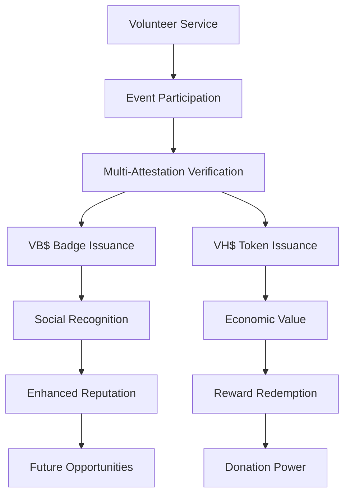
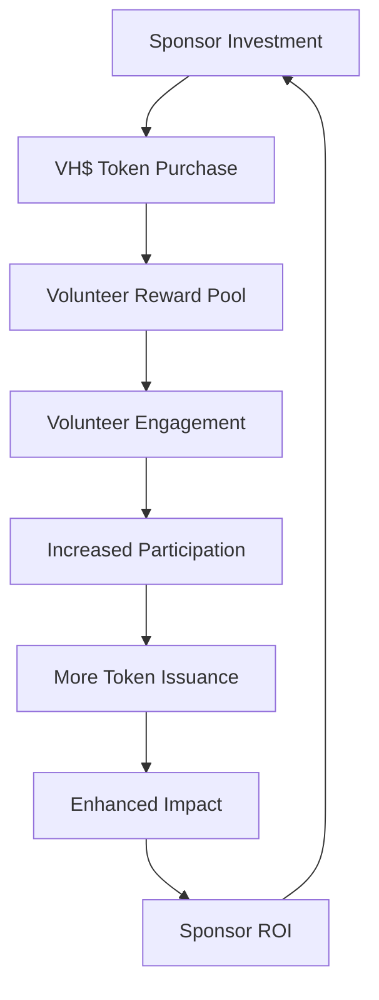

# Economic Model

## 💰 Sustainable Token Economics

WeHour's economic model is designed to create a sustainable, value-driven ecosystem that rewards volunteer service while preventing speculation and ensuring long-term viability.

---

## 🎯 Economic Principles

**Utility-First Design**: VH$ and VB$ tokens are designed for real-world utility, not speculation, creating sustainable value through actual use cases.

### Core Economic Principles
- **Utility-Driven Value**: Token value based on real-world utility, not speculation
- **Controlled Supply**: Issuance tied to verified volunteer hours
- **Natural Demand**: Organic demand from sponsors, retailers, and volunteers
- **Anti-Speculation**: No secondary trading, pure utility focus

---

## 📊 Token Supply Dynamics

### VH$ Supply Model

<ul>
<li><strong>Base Rate:</strong> 1 VH$ per verified volunteer hour</li>
<li><strong>Role Multipliers:</strong> 1.0x to 2.0x based on role complexity</li>
<li><strong>Quality Bonuses:</strong> Additional tokens for exceptional service</li>
<li><strong>Retention Rewards:</strong> Long-term volunteer loyalty bonuses</li>
<li><strong>Total Supply:</strong> Unlimited (based on verified hours)</li>
</ul>

### VB$ Supply Model

<ul>
<li><strong>Issuance Rate:</strong> 1 VB$ per event participation</li>
<li><strong>Event Types:</strong> All verified volunteer events</li>
<li><strong>Quality Standards:</strong> Minimum participation requirements</li>
<li><strong>Fraud Prevention:</strong> Multi-attestation verification</li>
<li><strong>Total Supply:</strong> Unlimited (based on events)</li>
</ul>

---

## 💎 Value Creation Mechanisms

### Supply Sources

<ul>
<li><strong>Volunteer Participation:</strong> Primary source of token creation</li>
<li><strong>Event Completion:</strong> Tokens issued after verified participation</li>
<li><strong>Quality Bonuses:</strong> Additional tokens for exceptional service</li>
<li><strong>Retention Rewards:</strong> Long-term engagement bonuses</li>
</ul>

### Demand Drivers

<ul>
<li><strong>Sponsor Purchases:</strong> Corporate funding of volunteer hours</li>
<li><strong>Retailer Integration:</strong> VH$ redemption for rewards</li>
<li><strong>Donation Programs:</strong> VH$ conversion to donations</li>
<li><strong>Cross-Chain Utility:</strong> Multi-network token usage</li>
</ul>

---

## 🔄 Token Flow Economics

### Primary Flow: Volunteer to Value

### Secondary Flow: Sponsor to Impact

---

## 💰 Revenue Streams

### Platform Revenue

<ul>
<li><strong>SaaS Subscriptions:</strong> HKD 500-2,000/org/month</li>
<li><strong>Transaction Fees:</strong> 5-10% on VH$ transactions</li>
<li><strong>Sponsor Packages:</strong> HKD 50-500k branded campaigns</li>
<li><strong>Premium Features:</strong> Advanced analytics and reporting</li>
</ul>

### Value Distribution

<ul>
<li><strong>Volunteers:</strong> 70% of token value goes to volunteers</li>
<li><strong>Organizations:</strong> 20% supports platform operations</li>
<li><strong>Platform:</strong> 10% for development and maintenance</li>
<li><strong>Reserves:</strong> 5% for ecosystem development</li>
</ul>

---

## 🎯 Economic Incentives

### Volunteer Incentives

<ul>
<li><strong>Immediate Rewards:</strong> VH$ tokens for verified service</li>
<li><strong>Long-term Value:</strong> Accumulated tokens for significant rewards</li>
<li><strong>Social Recognition:</strong> VB$ badges for reputation building</li>
<li><strong>Future Opportunities:</strong> Enhanced credentials for career advancement</li>
</ul>

### Organization Incentives

<ul>
<li><strong>Reduced Costs:</strong> Automated volunteer management</li>
<li><strong>Enhanced Funding:</strong> Verifiable impact data for funders</li>
<li><strong>Volunteer Retention:</strong> Recognition and reward systems</li>
<li><strong>Impact Measurement:</strong> Transparent reporting capabilities</li>
</ul>

### Sponsor Incentives

<ul>
<li><strong>Verifiable Impact:</strong> Transparent, auditable volunteer data</li>
<li><strong>Brand Association:</strong> Positive association with social causes</li>
<li><strong>ROI Measurement:</strong> Clear return on social investment</li>
<li><strong>Community Engagement:</strong> Direct connection with volunteer communities</li>
</ul>

---

## 🔒 Anti-Speculation Measures

### Token Design

<ul>
<li><strong>Utility Focus:</strong> Tokens designed for utility, not trading</li>
<li><strong>No Secondary Trading:</strong> VH$ and VB$ not tradeable on exchanges</li>
<li><strong>Use-It-or-Lose-It:</strong> Tokens expire if not used within timeframe</li>
<li><strong>Real-World Utility:</strong> Value tied to actual volunteer service</li>
</ul>

### Economic Controls

<ul>
<li><strong>Controlled Issuance:</strong> Tokens only issued for verified service</li>
<li><strong>Quality Standards:</strong> Minimum requirements for token issuance</li>
<li><strong>Fraud Prevention:</strong> Multi-attestation verification system</li>
<li><strong>Audit Trails:</strong> Complete transaction history for compliance</li>
</ul>

---

## 📈 Economic Metrics

### Key Performance Indicators

<ul>
<li><strong>Token Velocity:</strong> Rate of VH$ usage and redemption</li>
<li><strong>User Engagement:</strong> Active volunteers and organizations</li>
<li><strong>Value Creation:</strong> Total value generated for stakeholders</li>
<li><strong>Ecosystem Health:</strong> Overall platform activity and growth</li>
</ul>

### Economic Health Indicators

<ul>
<li><strong>Redemption Rate:</strong> VH$ tokens redeemed vs. held</li>
<li><strong>Donation Rate:</strong> VH$ tokens donated vs. redeemed</li>
<li><strong>Cross-Chain Activity:</strong> Multi-network token usage</li>
<li><strong>User Retention:</strong> Long-term volunteer engagement</li>
</ul>

---

## 🌍 Global Economic Impact

### Regional Economics

<ul>
<li><strong>Hong Kong:</strong> HKD 180M volunteer ecosystem value</li>
<li><strong>Asia-Pacific:</strong> $2.3B addressable market</li>
<li><strong>Global Expansion:</strong> International volunteer service recognition</li>
<li><strong>Cross-Border Value:</strong> International credential portability</li>
</ul>

### Economic Multipliers

<ul>
<li><strong>Volunteer Engagement:</strong> Increased participation rates</li>
<li><strong>Organization Growth:</strong> Enhanced funding opportunities</li>
<li><strong>Sponsor Investment:</strong> Increased corporate social investment</li>
<li><strong>Community Impact:</strong> Measurable social impact improvement</li>
</ul>

---

## 🚀 Economic Growth Strategy

### Phase 1: Foundation (0-12 months)

<ul>
<li><strong>Token Launch:</strong> VH$ and VB$ token deployment</li>
<li><strong>Pilot Programs:</strong> 2-3 anchor events with 500-1,000 volunteers</li>
<li><strong>Partner Integration:</strong> 10+ organizations, 1-2 retailers</li>
<li><strong>Economic Validation:</strong> Prove token utility and value</li>
</ul>

### Phase 2: Growth (12-24 months)

<ul>
<li><strong>Scale Operations:</strong> 5-10k volunteers, 100k+ verified hours</li>
<li><strong>Market Expansion:</strong> 3-5 major retailers, cross-chain functionality</li>
<li><strong>Revenue Growth:</strong> Sustainable revenue streams</li>
<li><strong>Ecosystem Development:</strong> Enhanced platform features</li>
</ul>

### Phase 3: Maturity (24+ months)

<ul>
<li><strong>Global Expansion:</strong> International markets and recognition</li>
<li><strong>Ecosystem Integration:</strong> Cross-platform and cross-chain integration</li>
<li><strong>Sustainable Growth:</strong> Self-sustaining economic model</li>
<li><strong>Industry Leadership:</strong> Standard-setting for volunteer service</li>
</ul>

---

## 💡 Economic Use Cases

### Volunteer Scenarios

<ul>
<li><strong>Service:</strong> 4-hour community cleanup</li>
<li><strong>Earnings:</strong> 4 VH$ tokens, 1 VB$ badge</li>
<li><strong>Value:</strong> $4 in rewards, enhanced resume</li>
<li><strong>Impact:</strong> Community improvement, skill development</li>
</ul>

<ul>
<li><strong>Service:</strong> 8-hour event coordination</li>
<li><strong>Earnings:</strong> 16 VH$ tokens, 1 VB$ badge</li>
<li><strong>Value:</strong> $16 in rewards, leadership credentials</li>
<li><strong>Impact:</strong> Event success, professional development</li>
</ul>

### Corporate Scenarios

<ul>
<li><strong>Investment:</strong> $10,000 in volunteer hour funding</li>
<li><strong>Impact:</strong> 1,000+ verified volunteer hours</li>
<li><strong>ROI:</strong> Measurable social impact, brand recognition</li>
<li><strong>Value:</strong> Enhanced CSR reputation, community engagement</li>
</ul>

---

## 🔮 Future Economic Evolution

### Advanced Economic Features

<ul>
<li><strong>Dynamic Pricing:</strong> Market-based token pricing</li>
<li><strong>Staking Mechanisms:</strong> Token staking for enhanced rewards</li>
<li><strong>Governance Tokens:</strong> Community governance participation</li>
<li><strong>Cross-Platform Integration:</strong> Multi-platform token utility</li>
</ul>

### Economic Innovation

<ul>
<li><strong>AI-Powered Optimization:</strong> Intelligent token distribution</li>
<li><strong>Predictive Analytics:</strong> Forecast volunteer engagement</li>
<li><strong>Personalized Rewards:</strong> Customized reward systems</li>
<li><strong>Social Impact Bonds:</strong> Innovative funding mechanisms</li>
</ul>

---

## 📊 Economic Sustainability

### Long-term Viability

<ul>
<li><strong>Revenue Diversification:</strong> Multiple revenue streams</li>
<li><strong>Cost Management:</strong> Efficient operations and cost control</li>
<li><strong>Value Creation:</strong> Continuous value for all stakeholders</li>
<li><strong>Ecosystem Growth:</strong> Sustainable platform expansion</li>
</ul>

### Risk Management

<ul>
<li><strong>Economic Risks:</strong> Diversified revenue and cost management</li>
<li><strong>Regulatory Risks:</strong> Compliance and legal framework</li>
<li><strong>Technical Risks:</strong> Robust infrastructure and security</li>
<li><strong>Market Risks:</strong> Market adaptation and innovation</li>
</ul>

---

*WeHour's economic model creates a sustainable, value-driven ecosystem that rewards volunteer service while ensuring long-term viability. Through utility-focused token design, controlled supply mechanisms, and natural demand drivers, the platform creates real value for all stakeholders while preventing speculation and maintaining economic stability.*
