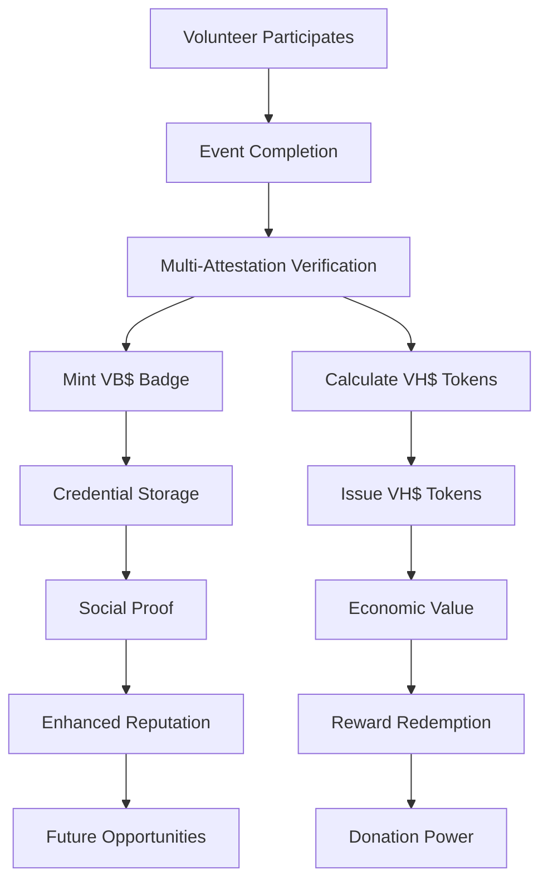
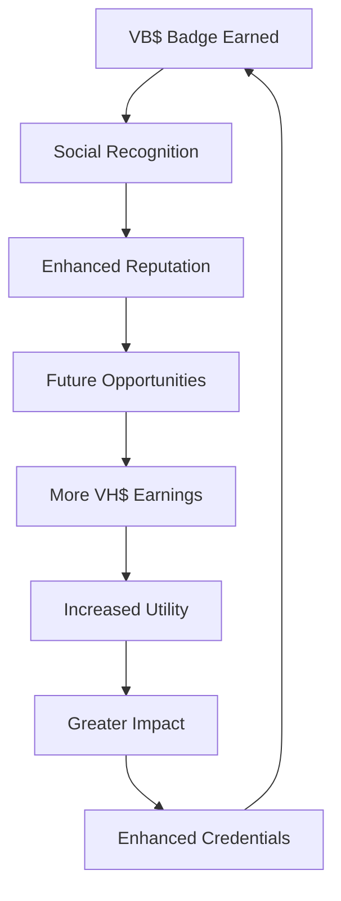

# Token Correlations

## 🔗 The Synergistic Relationship Between VH$ and VB$

The WeHour ecosystem's dual-token model creates powerful correlations between VH$ (WeHours Token) and VB$ (Badge Token) that drive value creation, user engagement, and ecosystem growth.

---

## 🎯 Core Correlation Principles

**VH$ and VB$ work together to create a comprehensive volunteer service ecosystem where credentials enable utility and utility validates credentials**

### Complementary Functions
- **VB$ provides proof** → **VH$ provides value**
- **VB$ enables verification** → **VH$ enables rewards**
- **VB$ builds reputation** → **VH$ builds wealth**
- **VB$ creates credentials** → **VH$ creates utility**

---

## 📊 Correlation Matrix

| Aspect | VH$ (WeHours Token) | VB$ (Badge Token) | Correlation |
|--------|-------------------|-------------------|-------------|
| **Purpose** | Economic Utility | Social Proof | Complementary |
| **Transferability** | Transferable | Non-transferable | Balanced |
| **Issuance** | Per Hour | Per Event | Proportional |
| **Value** | Monetary | Reputation | Synergistic |
| **Use Cases** | Rewards/Donations | Verification/Credentials | Interdependent |

---

## 🔄 Token Interaction Flows

### Primary Flow: Event Participation

### Secondary Flow: Value Creation

---

## 💎 Synergistic Benefits

### For Volunteers
<ul>
<li><strong>VB$ Credentials:</strong> Prove participation and build reputation</li>
<li><strong>VH$ Rewards:</strong> Convert service into tangible benefits</li>
<li><strong>Enhanced Recognition:</strong> VB$ badges increase social status</li>
<li><strong>Economic Benefits:</strong> VH$ tokens provide real value</li>
</ul>

### For Organizations
<ul>
<li><strong>VB$ Verification:</strong> Immutable proof of volunteer participation</li>
<li><strong>VH$ Analytics:</strong> Economic value of volunteer contributions</li>
<li><strong>Impact Measurement:</strong> Combined social and economic impact</li>
<li><strong>Retention Insights:</strong> Track both credential and reward engagement</li>
</ul>

### For Sponsors
<ul>
<li><strong>VB$ Proof:</strong> Verifiable volunteer participation</li>
<li><strong>VH$ Value:</strong> Quantifiable economic impact</li>
<li><strong>ROI Measurement:</strong> Clear return on social investment</li>
<li><strong>Impact Verification:</strong> Transparent, auditable results</li>
</ul>

---

## 📈 Correlation Metrics

### Positive Correlations
<ul>
<li><strong>Badge Count ↔ Token Holdings:</strong> More badges = more tokens</li>
<li><strong>Verification Rate ↔ Redemption Rate:</strong> Verified badges drive token usage</li>
<li><strong>Social Recognition ↔ Economic Value:</strong> Reputation enhances utility</li>
<li><strong>Long-term Engagement ↔ Both Tokens:</strong> Sustained participation increases both</li>
</ul>

### Negative Correlations
<ul>
<li><strong>Fraud Rate ↔ Token Value:</strong> Fraud decreases token value</li>
<li><strong>Revocation Rate ↔ Trust:</strong> High revocation reduces trust</li>
<li><strong>Speculation ↔ Utility:</strong> Speculation reduces utility focus</li>
<li><strong>Centralization ↔ Decentralization:</strong> Centralized control reduces trust</li>
</ul>

---

## 🔄 Token Lifecycle Correlations

### Issuance Phase
<ul>
<li><strong>Event Completion:</strong> Both tokens issued after verified participation</li>
<li><strong>Role Multipliers:</strong> Leadership roles earn more VH$ and enhanced VB$ metadata</li>
<li><strong>Quality Bonuses:</strong> Exceptional service earns bonus VH$ and special VB$ badges</li>
<li><strong>Retention Rewards:</strong> Long-term volunteers earn loyalty bonuses in both tokens</li>
</ul>

### Usage Phase
<ul>
<li><strong>VB$ Verification:</strong> Required for VH$ redemption in some cases</li>
<li><strong>VH$ Rewards:</strong> Enhanced rewards for holders of specific VB$ badges</li>
<li><strong>Cross-Platform:</strong> VB$ credentials enable VH$ usage across platforms</li>
<li><strong>Donation Matching:</strong> VB$ badge holders receive enhanced VH$ donation matching</li>
</ul>

### Value Phase
<ul>
<li><strong>Reputation Value:</strong> VB$ badges increase VH$ earning potential</li>
<li><strong>Economic Value:</strong> VH$ tokens validate VB$ badge worth</li>
<li><strong>Network Effects:</strong> More users increase value of both tokens</li>
<li><strong>Ecosystem Growth:</strong> Token correlation drives overall platform growth</li>
</ul>

---

## 🌐 Cross-Chain Correlations

### Multi-Network Synergy
<ul>
<li><strong>VB$ Portability:</strong> Credentials recognized across all networks</li>
<li><strong>VH$ Utility:</strong> Tokens usable on any supported network</li>
<li><strong>Network Effects:</strong> Multi-chain presence increases both token values</li>
<li><strong>Global Recognition:</strong> International credential and utility access</li>
</ul>

### Network-Specific Correlations
<ul>
<li><strong>Ethereum L2:</strong> High security, premium credentials and rewards</li>
<li><strong>BSC:</strong> Low cost, high volume, mass adoption</li>
<li><strong>Future Networks:</strong> Specialized use cases and enhanced features</li>
<li><strong>Cross-Chain Bridges:</strong> Seamless token and credential transfers</li>
</ul>

---

## 📊 Correlation Analytics

### Key Correlation Metrics
<ul>
<li><strong>Token Correlation Coefficient:</strong> Statistical relationship between VH$ and VB$ usage</li>
<li><strong>User Engagement Correlation:</strong> How badge earning affects token usage</li>
<li><strong>Value Correlation:</strong> Relationship between credential value and token value</li>
<li><strong>Network Correlation:</strong> Cross-chain token and credential relationships</li>
</ul>

### Advanced Analytics
<ul>
<li><strong>Predictive Correlation:</strong> Forecast token and credential trends</li>
<li><strong>Behavioral Analysis:</strong> Understand user token and credential patterns</li>
<li><strong>Optimization Recommendations:</strong> Suggest improvements to token correlations</li>
<li><strong>Risk Assessment:</strong> Identify potential correlation risks</li>
</ul>

---

## 🎯 Correlation Strategies

### User Engagement Strategies
<ul>
<li><strong>Badge Incentives:</strong> Special VH$ rewards for specific VB$ badge holders</li>
<li><strong>Token Bonuses:</strong> Enhanced VB$ metadata for high VH$ holders</li>
<li><strong>Cross-Token Rewards:</strong> Benefits for users with both token types</li>
<li><strong>Community Recognition:</strong> Social status for active token and credential users</li>
</ul>

### Ecosystem Growth Strategies
<ul>
<li><strong>Network Effects:</strong> Leverage token correlations for viral growth</li>
<li><strong>Value Creation:</strong> Create new value through token interactions</li>
<li><strong>Partnership Synergies:</strong> Align token correlations with partner strategies</li>
<li><strong>Innovation Drivers:</strong> Use correlations to drive platform innovation</li>
</ul>

---

## 🔮 Future Correlation Evolution

### Advanced Correlation Features
<ul>
<li><strong>Dynamic Multipliers:</strong> VB$ badge quality affects VH$ earning rates</li>
<li><strong>Cross-Token Staking:</strong> Stake both tokens for enhanced rewards</li>
<li><strong>Correlation-Based Rewards:</strong> Rewards based on token correlation patterns</li>
<li><strong>AI-Optimized Correlations:</strong> Machine learning to optimize token relationships</li>
</ul>

### Ecosystem Integration
<ul>
<li><strong>International Recognition:</strong> Cross-border token and credential correlations</li>
<li><strong>Multi-Platform Integration:</strong> Correlations across different platforms</li>
<li><strong>Standardized Metrics:</strong> Global standards for token correlation measurement</li>
<li><strong>Interoperability:</strong> Seamless correlation across different systems</li>
</ul>

---

## 💡 Correlation Examples

### High-Value Volunteer
<ul>
<li><strong>VB$ Portfolio:</strong> 15+ badges across multiple causes</li>
<li><strong>VH$ Holdings:</strong> 500+ tokens from sustained participation</li>
<li><strong>Correlation:</strong> High badge count enables premium VH$ rewards</li>
<li><strong>Benefits:</strong> Enhanced reputation + economic value</li>
</ul>

### Corporate Sponsor
<ul>
<li><strong>VB$ Verification:</strong> Verifiable volunteer participation data</li>
<li><strong>VH$ Investment:</strong> $10,000+ in volunteer hour purchases</li>
<li><strong>Correlation:</strong> VB$ proof validates VH$ investment value</li>
<li><strong>ROI:</strong> Measurable social impact + brand recognition</li>
</ul>

### Organization Impact
<ul>
<li><strong>VB$ Issuance:</strong> 1,000+ badges issued to volunteers</li>
<li><strong>VH$ Circulation:</strong> 50,000+ tokens in volunteer ecosystem</li>
<li><strong>Correlation:</strong> High badge issuance drives token circulation</li>
<li><strong>Impact:</strong> Increased volunteer engagement + funding opportunities</li>
</ul>

---

## 🔒 Correlation Security

### Anti-Manipulation Measures
<ul>
<li><strong>Fraud Detection:</strong> AI-powered correlation anomaly detection</li>
<li><strong>Audit Trails:</strong> Complete correlation history tracking</li>
<li><strong>Validation Systems:</strong> Multi-source correlation verification</li>
<li><strong>Risk Management:</strong> Proactive correlation risk assessment</li>
</ul>

### Transparency Measures
<ul>
<li><strong>Public Analytics:</strong> Open correlation data and insights</li>
<li><strong>Real-Time Monitoring:</strong> Live correlation tracking and reporting</li>
<li><strong>Community Reporting:</strong> User-driven correlation insights</li>
<li><strong>Regulatory Compliance:</strong> Transparent correlation reporting</li>
</ul>

---

*The correlation between VH$ and VB$ tokens creates a powerful synergy that drives value creation, user engagement, and ecosystem growth. Through their complementary functions and interdependent relationships, these tokens work together to create a comprehensive volunteer service ecosystem that benefits all stakeholders.*
